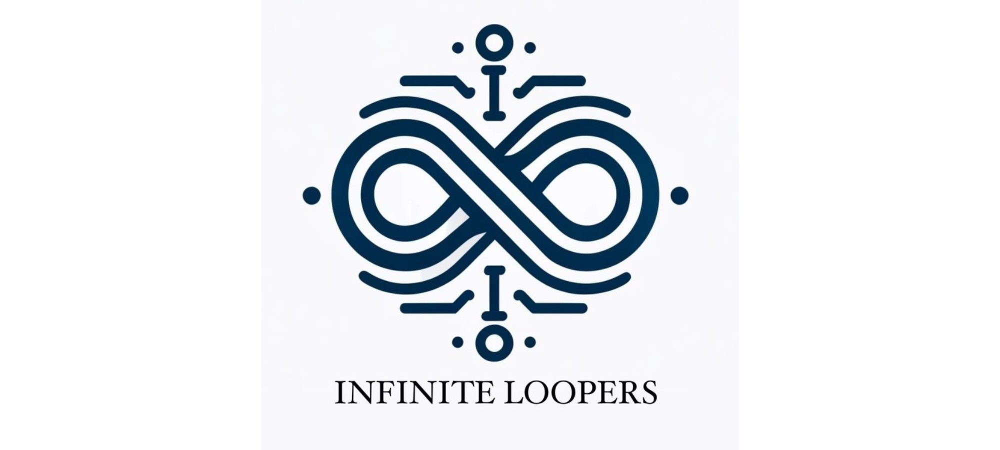

# Infinite Loopers - The Republic

> The Republic project aims to revolutionize citizen engagement with government services by providing a platform for individuals to share their experiences, report incidents, and voice their concerns. This initiative is designed to enhance transparency and accountability within government operations, allowing users to contribute to a public discourse that promotes improved service delivery. By organizing and analyzing user-generated content, The Republic seeks to provide a clear and comprehensive picture of government service performance, fostering a more informed and active citizenry.

# Demo Resources

| Demo   | Video                                                                                                          | Slides                                                                                                                                                                         |
| ------ | -------------------------------------------------------------------------------------------------------------- | ------------------------------------------------------------------------------------------------------------------------------------------------------------------------------ |
| Demo 1 | [InfiniteLoopers-Demo1](https://drive.google.com/file/d/1kq7h8HXzmYTXZwq0jo13LooH_8M5kjMx/view?usp=drive_link) | [Demo 1 Slides](https://www.canva.com/design/DAGG4_iuy44/iqlGvxp0i5SekCY6Ez_RQA/edit?utm_content=DAGG4_iuy44&utm_campaign=designshare&utm_medium=link2&utm_source=sharebutton) |
| Demo 2 | [InfiniteLoopers-Demo2](https://drive.google.com/file/d/17EW3HTqoN-14ORK8A0OgFcvNDD3qFsIy/view?usp=drive_link)               | [Demo 2 Slides](https://www.canva.com/design/DAGIqTO5pm0/8a0ufCyylomFZPgixK5pjA/view?utm_content=DAGIqTO5pm0&utm_campaign=designshare&utm_medium=link&utm_source=editor)                                                                                                             |

# Link To Project Board

- [The Republic Project Board](https://github.com/orgs/COS301-SE-2024/projects/79)

# Documentation

The documentation provides different versions and progress for each demo, guiding you through various aspects of the project, including architectural design, implementation details, and user guidelines - [Click Here to See Documentation Versions](./documentation/README.md)

## Links to the Latest Documentation of the Project

- [Coding Standards](./documentation/specifications/CodingStandardsVersion2.md)
- [Requirements Specification](./documentation/specifications/RequirementsSpecificationVersion2.md)
- [Delivery Specification](./documentation/specifications/DeliverySpecificationVersion2.md)
- [Testing Specification](./documentation/specifications/TestingSpecificationVersion2.md)
- [User Manual](./documentation/specifications/UserManualVersion2.md)
- [Architectural Specification](./documentation/specifications/ArchitecturalSpecificationVersion2.md)
- [API / Services Contract](./specifications/APISpecificationVersion2.md)

<h1 align="center">Meet The Infinite Loopers!</h1>

<table style="border-width: 1px; width: 100%; font-family: Arial, sans-serif; border-collapse: collapse">
  <tr>
    <td style="vertical-align: top; width: auto; border: 0; padding: 10px;">
      
    </td>
    <td style="vertical-align: top; width: auto; border: 0; padding: 10px;">
      <h2>
        <b style="font-size: 18px;">SHAMA KAMINA</b>
      </h2>
      <b style="font-size: 16px;">UI/UX Designer & Frontend Developer</b>
        As a UI/UX designer, I am committed to enhancing user experiences and making life easier through thoughtful design. I focus on identifying user problems and creating intuitive solutions using my skills in both design and front-end development. My work aims to bridge the gap between functionality and aesthetics, ensuring that the products I design are both effective and enjoyable to use.
        
      <b style="font-size: 16px;">Profile Links</b>
        
      
      
        
      <b style="font-size: 16px;">Technologies & Tools Used</b>
        
      
      
      
      
      
      
    </td>
  </tr>
  <tr>
    <td style="vertical-align: top; width: auto; border: 0; padding: 10px;">
      
    </td>
    <td style="vertical-align: top; width: auto; border: 0; padding: 10px;">
      <h2>
        <b style="font-size: 18px;">MULISA MUSEHANE</b>
      </h2>
      <b style="font-size: 16px;">UI/UX Designer & Frontend Developer</b>
        I am a dedicated UI/UX designer passionate about creating visually appealing and user-friendly software. My expertise lies in front-end development and design, where I combine creativity with technical skills to improve user experiences. I enjoy using design tools and frameworks to bring ideas to life, ensuring that every product I work on is both beautiful and functional.
        
      <b style="font-size: 16px;">Profile Links</b>
        
      
      
        
      <b style="font-size: 16px;">Technologies & Tools Used</b>
        
      
      
      
      
      
      
    </td>
  </tr>
  <tr>
    <td style="vertical-align: top; width: auto; border: 0; padding: 10px;">
      
    </td>
    <td style="vertical-align: top; width: auto; border: 0; padding: 10px;">
      <h2>
        <b style="font-size: 18px;">SIBISI MATHEBE</b>
      </h2>
      <b style="font-size: 16px;">Backend Engineer</b>
        I am a passionate backend engineer who thrives on solving complex problems with elegant solutions. My fascination with backend technologies drives me to continuously learn and explore new horizons in software development. I specialize in creating robust and scalable applications using a range of backend tools and services.
        
      <b style="font-size: 16px;">Profile Links</b>
        
      
      
        
      <b style="font-size: 16px;">Technologies & Tools Used</b>
        
      
      
      
      
      
      
    </td>
  </tr>
  <tr>
    <td style="vertical-align: top; width: auto; border: 0; padding: 10px;">
      
    </td>
    <td style="vertical-align: top; width: auto; border: 0; padding: 10px;">
      <h2>
        <b style="font-size: 18px;">SELLO SELEPE</b>
      </h2>
      <b style="font-size: 16px;">Backend Engineer & DevOps</b>
        I am a diligent backend engineer and DevOps professional, committed to delivering high-quality, cost-efficient solutions. I focus on adding value to team objectives through my expertise in backend development and continuous integration/continuous deployment (CI/CD) practices. My work is characterized by professionalism, self-discipline, and an open-minded approach to problem-solving.
        
      <b style="font-size: 16px;">Profile Links</b>
        
      
      
        
      <b style="font-size: 16px;">Technologies & Tools Used</b>
        
      
      
      
      
      
      
    </td>
  </tr>
  <tr>
    <td style="vertical-align: top; width: auto; border: 0; padding: 10px;">
      
    </td>
    <td style="vertical-align: top; width: auto; border: 0; padding: 10px;">
      <h2>
        <b style="font-size: 18px;">HLOKOMANI KHONDLO</b>
      </h2>
      <b style="font-size: 16px;">Integration Engineer</b>
        I am an integration engineer driven by the desire to understand and optimize how systems work. My passion for software engineering allows me to create seamless integrations that enhance product functionality and user experience. I specialize in using various tools and technologies to connect different systems and ensure they work together efficiently.
        
      <b style="font-size: 16px;">Profile Links</b>
        
      
      
        
      <b style="font-size: 16px;">Technologies & Tools Used</b>
        
      
      
      
      
      
      
    </td>
  </tr>
</table>

---

Feel free to contact us at: [inifiniteloopers@gmail.com](mailto:inifiniteloopers@gmail.com)

---
