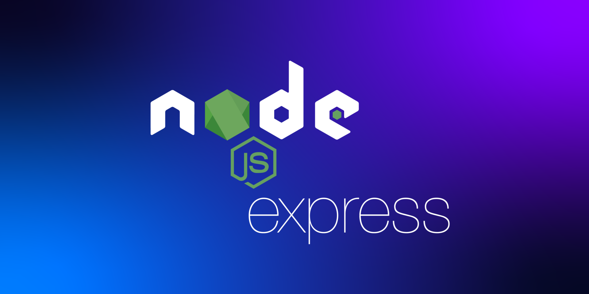

# Node.js Express Backend with TypeScript Documentation

<div style="width: 100%; height: 40%; border-radius:20px; background-color: black; margin: 20px 0;">
    
</div>

> This document provides comprehensive information on the Node.js Express backend application written in TypeScript. The application uses Express for handling HTTP requests and Supabase for authentication and PostgreSQL database operations.

## Table of Contents

1. [Coding Standards](#coding-standards)
2. [Installation](#installation)
3. [Configuration](#configuration)
4. [API Endpoints](#api-endpoints)
    - [GET /](#get-)
    - [GET /users](#get-users)
5. [Using Supabase](#using-supabase)
    - [Authentication](#authentication)
    - [Database Operations](#database-operations)
6. [Project Structure](#project-structure)
7. [Running the Project](#running-the-project)

## Coding Standards:

- Maintaining high coding standards is crucial for the success of The Republic project. We have a document which provides guidelines and best practices for ensuring a clean, readable, and maintainable codebase.
- Please read the document here: [Coding Standards](./../documentation/specifications/CodingStandards.md)
- Read this for the Full Documentation: [Documentation](./../documentation/README.md)

## Installation

Follow these steps to install the application:

1. **Clone the repository:**

    ```bash
    git clone https://github.com/your-repo/node-express-ts-backend.git
    cd node-express-ts-backend
    ```

2. **Install dependencies:**

    ```bash
    npm install
    ```

3. **Install TypeScript (if not already installed globally):**

    ```bash
    npm install -g typescript
    ```

## Configuration

1. **Create a `.env` file in the root directory and add your Supabase URL and anon key:**

    ```env
    SUPABASE_URL=https://your-project-url.supabase.co
    SUPABASE_ANON_KEY=your-anon-key
    ```

2. **Modify the `supabaseClient.ts` file to use environment variables:**

    ```typescript
    import { createClient } from '@supabase/supabase-js';
    import dotenv from 'dotenv';

    dotenv.config();

    const supabaseUrl = process.env.SUPABASE_URL as string;
    const supabaseAnonKey = process.env.SUPABASE_ANON_KEY as string;

    const supabase = createClient(supabaseUrl, supabaseAnonKey);

    export default supabase;
    ```

## Example: API Endpoints

### GET /

**Description:** Returns a welcome message.

**Endpoint:** `GET /`

**Response:**

- `200 OK`: Returns a welcome message.

**Example:**

```json
{
  "message": "Hello, Express!"
}
```

### GET /users

**Description:** Retrieves a list of users from the Supabase database.

**Endpoint:** `GET /users`

**Response:**

- `200 OK`: Returns a list of users.
- `500 Internal Server Error`: Returns an error message if the request fails.

**Example:**

```json
[
  {
    "id": 1,
    "name": "John Doe",
    "email": "john@example.com"
  },
  {
    "id": 2,
    "name": "Jane Doe",
    "email": "jane@example.com"
  }
]
```

## Example: Using Supabase

### Authentication

Supabase provides user authentication through various methods. For this project, ensure you have configured authentication in your Supabase project. Refer to the [Supabase Auth Documentation](https://supabase.io/docs/guides/auth) for more details.

### Database Operations

Supabase allows you to perform CRUD operations on your PostgreSQL database. This application uses the Supabase client to fetch user data.

**Example Usage:**

In `users.ts`:

```typescript
import { Router, Request, Response } from 'express';
import supabase from './supabaseClient';

const router = Router();

router.get('/users', async (req: Request, res: Response) => {
  const { data, error } = await supabase.from('users').select('*');
  
  if (error) {
    res.status(500).send(error.message);
  } else {
    res.json(data);
  }
});

export default router;
```

## Project Structure

```
/your-project
|-- node_modules
|-- src
|   |-- server.ts
|   |-- users.ts
|   |-- supabaseClient.ts
|   |-- [more files here]
|-- package.json
|-- tsconfig.json
|-- .env
|-- dist
|   |-- server.js
|   |-- users.js
|   |-- supabaseClient.js
|   |-- [more files here]
```

- **src/server.ts:** Main server file.
- **src/users.ts:** User route handler.
- **src/supabaseClient.ts:** Supabase client setup.
- **dist/:** Compiled JavaScript files.

## Running the Project

To run the backend project located at "path/to/The-Republic/backend," follow these steps:

1. **Compile TypeScript files:**

    First, navigate to the root directory of the backend project. Then, compile the TypeScript files by executing the following command:

    ```bash
    npx tsc
    ```

    This command uses the TypeScript compiler (`tsc`) to transpile the TypeScript files in the project into JavaScript. The compiled files will be placed in the designated output directory, typically `dist`.

2. **Start the server:**

    After the TypeScript files have been successfully compiled, start the server by running:

    ```bash
    node dist/server.js
    ```

    This command uses Node.js to execute the compiled server file (`server.js`) located in the `dist` directory. Once the server starts, it will be ready to handle requests and run the backend services for the project.

3. **Access the API:**

    - Open your browser and navigate to `http://localhost:8080/` to see the welcome message.
    - Navigate to `http://localhost:8080/users` to see the list of users.

---

[Read Project Documentation](./../documentation/README.md)

---

These documents collectively ensure that The Republic project is developed, tested, and delivered to the highest standards, providing a robust platform for citizen engagement and government accountability.

Feel free to contact us at: [infiniteloopers@gmail.com](mailto:infiniteloopers@gmail.com)

<details>
    <summary> :lock: Secret Message</summary>
    <br/>
    <p>Thank you for opening this, Have a great day! :smile:</p>
</details>

---