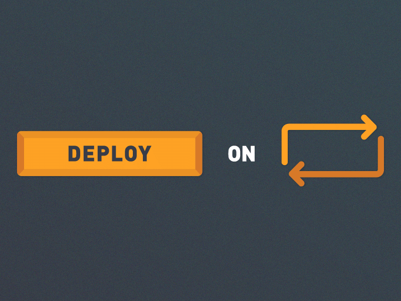

<div>
    
</div>

---

# Delivery Specification

## Overview

This document covers the delivery aspects of The Republic project, including deployment strategies and post-deployment support.

## Contents

- Introduction
- Deployment Strategies
- Environment Setup
- Continuous Integration/Continuous Deployment (CI/CD)
- Post-Deployment Support
- Rollback Procedures
- Future Plans
- Conclusion

## Introduction

The Republic aims to provide a reliable and scalable platform for citizen engagement. This document outlines the strategies and procedures for deploying the system, ensuring smooth and efficient delivery, and providing post-deployment support.

## Deployment Strategies

- ### Node.js Application Deployment to Vercel

  The backend Node.js application will be deployed to Vercel. This involves setting up the Vercel environment, configuring buildpacks, setting environment variables, and deploying the application code. Vercel provides a scalable and easy-to-manage platform for hosting the backend service.

  - #### Buildpack for the Backend Server

  ```typescript
  const path = require("path");
  const webpack = require("webpack");
  const TsconfigPathsPlugin = require("tsconfig-paths-webpack-plugin");

  module.exports = {
    mode: "production",
    entry: "./src/server.ts",
    output: {
      filename: "server.js",
      path: path.resolve(__dirname, "public"),
    },
    resolve: {
      extensions: [".ts", ".js"],
      plugins: [new TsconfigPathsPlugin()],
    },
    module: {
      rules: [
        {
          test: /\.ts$/,
          use: "ts-loader",
          exclude: /node_modules/,
        },
      ],
    },
    target: "node",
    plugins: [
      new webpack.ContextReplacementPlugin(
        /express\/lib/,
        path.resolve(__dirname, "src"),
      ),
    ],
  };
  ```

  - #### Vercel Deployment

   To deploy to vercel one can just link the vercel projec to the repository and add `backend` as the Project Directory. Below is a vercel.json file used to deploy.

    ```json
    {
      "version": 2,
      "builds": [
        {
          "src": "public/server.js",
          "use": "@vercel/node"
        }
      ],
      "routes": [
        {
          "src": "/(.*)",
          "dest": "public/server.js"
        }
      ]
    }
    ```

  - #### When Deploying the Application to Heroku

    - ##### Example CI/CD Job for Heroku Deployment

      ```yaml
      name: Deploy Backend to Heroku

      on:
        ...

      jobs:
      deploy-backend:
        runs-on: ubuntu-latest
        steps:
            - name: Checkout code
            uses: actions/checkout@v3

            - name: Deploy Backend to Heroku
            uses: akhileshns/heroku-deploy@v3.12.12
            with:
              heroku_api_key: ${{ secrets.HEROKU_API_KEY }}
              heroku_app_name: ${{ secrets.HEROKU_BACKEND }}
              heroku_email: ${{ secrets.HEROKU_EMAIL }}
      ```

    - ##### Setting Configuration Variables

      You can set configuration variables in Heroku using the following command syntax:

      ```bash
      heroku config:set -a backend-appname APP_BASE=backend
      heroku config:set -a frontend-appname APP_BASE=frontend
      ```

    - ##### Setting the Git Remote

      Set the git remote for your Heroku app with:

      ```bash
      heroku git:remote -a appname'
      ```

- ### Deployment to DockerHub

  The backend and reverse proxy components will also be containerized and deployed using Docker. Docker images for these components will be built and pushed to Docker Hub. This ensures a consistent runtime environment and facilitates easy scaling and management of these services.

  ###### Example CI/CD Job for Docker Deployment

  ```yaml
  name: Build and Push Docker Images

  on:
     ...

  jobs:
  build-and-push:
     runs-on: ubuntu-latest
     steps:
        - name: Checkout code
        uses: actions/checkout@v3

        - name: Set up Docker Buildx
        uses: docker/setup-buildx-action@v3

        - name: Login to Docker Hub
        uses: docker/login-action@v3
        with:
           username: ${{ secrets.DOCKER_USERNAME }}
           password: ${{ secrets.DOCKER_PASSWORD }}

        - name: Build and push backend Docker image
        run: |
           docker build -t myproject-backend ./backend
           docker tag myproject-backend ${{ secrets.DOCKER_USERNAME }}/myproject-backend:latest
           docker push ${{ secrets.DOCKER_USERNAME }}/myproject-backend:latest

        - name: Build and push reverse proxy Docker image
        run: |
           docker build -t myproject-reverseproxy ./reverseproxy
           docker tag myproject-reverseproxy ${{ secrets.DOCKER_USERNAME }}/myproject-reverseproxy:latest
           docker push ${{ secrets.DOCKER_USERNAME }}/myproject-reverseproxy:latest
  ```

## Environment Setup

Ensure all necessary environment variables and configurations are set up in the respective deployment environments (Heroku, Docker, etc.). Proper environment setup is crucial for the smooth operation of the applications.

- ##### Backend Example `.env`:

  ```env
  SUPABASE_URL={{VALUE}}
  SUPABASE_SERVICE_ROLE_KEY={{VALUE}}
  SUPABASE_ANON_KEY={{VALUE}}
  OPENAI_API_KEY={{VALUE}}
  ALLOWED_ORIGIN={{VALUE}}
  REDIS_URL={{VALUE}}
  RESEND_API_KEY={{VALUE}}
  PORT=8080
  ```

- ##### Frontend Example `.env`:

  ```env
  NEXT_PUBLIC_SUPABASE_URL={{VALUE}}
  NEXT_PUBLIC_SUPABASE_ANON_KEY={{VALUE}}
  NEXT_PUBLIC_BACKEND_URL={{VALUE}}
  NEXT_PUBLIC_GOOGLE_MAPS_API_KEY={{VALUE}}
  NEXT_PUBLIC_AZURE_CONTENT_MODERATOR_URL={{VALUE}}
  NEXT_PUBLIC_AZURE_CONTENT_MODERATOR_KEY={{VALUE}}
  NEXT_PUBLIC_AZURE_IMAGE_CONTENT_SAFETY_URL={{VALUE}}
  NEXT_PUBLIC_AZURE_IMAGE_CONTENT_SAFETY_KEY={{VALUE}}
  NEXT_PUBLIC_FRONTEND_URL={{VALUE}}
  ```

## Continuous Integration/Continuous Deployment (CI/CD)

The project uses GitHub Actions for CI/CD pipelines. The workflows are triggered on specific branches and after successful unit testing. The CI/CD pipelines handle building, testing, and deploying the applications to both Heroku and Docker environments. This ensures that the code is always in a deployable state and reduces manual intervention.

## Post-Deployment Support

- ### Monitoring and Logging

  - We ensure continuous monitoring and logging for the deployed applications to quickly identify and address any issues. Use Vercel's built-in tools and other monitoring services as needed.
  - For Docker deployments, we utilize monitoring tools compatible with Docker to track the performance and health of the containers.

- ### Troubleshooting

  - If issues arise during or after deployment, we consult the deployment logs and monitoring tools to diagnose and resolve problems promptly.
  - Both Vercel and Docker provide robust logging capabilities to aid in troubleshooting.

## Rollback Procedures

Our goal is to ensure high reliability and availability of The Republic platform. By deploying to vercel or AWS and implementing robust scaling strategies, we aim to minimize downtime and ensure that our services are always accessible to users.

## Future Deployment and Management Plans

- ### AWS Hosting

  - We are planning to host our backend Node.js Express server as well as the frontend Next.js app on AWS if Vercel Gives us issues.
  - This move will also allow us to leverage AWS's extensive suite of services for greater flexibility, performance, and scalability.

- ### Horizontal Autoscaling

  - To handle an increasing number of posts and users, we will implement horizontal autoscaling.
  - This strategy will enable our infrastructure to automatically adjust capacity to maintain performance and availability as demand changes, aiming to efficiently handle 10,000+ posts and numerous concurrent users.

- ### Reliability and Availability

  - Our goal is to ensure high reliability and availability of The Republic platform.
  - By deploying to AWS and implementing robust scaling strategies, we aim to minimize downtime and ensure that our services are always accessible to users.

---

[Back](./../README.md)

<br>

[Back to main](/README.md)
