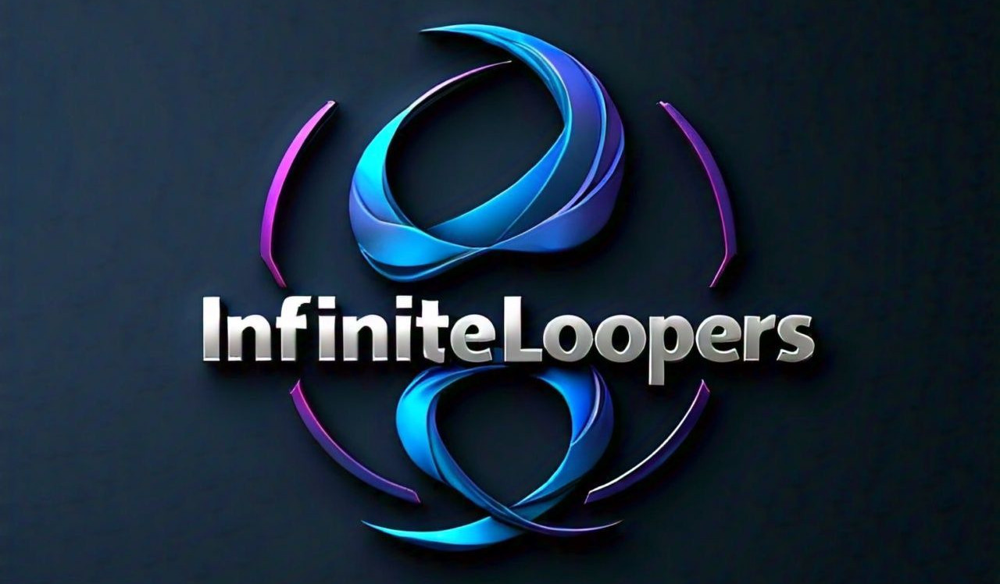

# Project Documentation

    

> Welcome to The Republic project, an initiative aimed at revolutionizing citizen engagement with government services through a dynamic, user-friendly platform. This documentation will guide you through various aspects of the project, including architectural design, implementation details, and user guidelines.

## Table of Contents

1. [Architectural Specification](#architectural-specification)
2. [Design Specification](#design-specification)
3. [Project Plan](#project-plan)
4. [Testing Specification](#testing-specification)
5. [Delivery Specification](#delivery-specification)
6. [Implementation Specification](#implementation-specification)
7. [Requirements Specification](#requirements-specification)
8. [User Manual](#user-manual)
9. [Coding Standards](#coding-standards)

---

## Architectural Specification

### Overview

This document outlines the architectural design of The Republic project, including the system’s performance, scalability, and modularity requirements.

[Link to Architectural Specification](./specifications/ArchitecturalSpecification.md)

## Design Specification

### Overview

This document details the design elements of the project, focusing on user interface and user experience considerations, as well as the visual aspects of the platform.

[Link to Design Specification](./specifications/DesignSpecification.md)

## Project Plan

### Overview

This document outlines the project timeline, milestones, and the tasks required to achieve the project goals.

[Link to Project Plan](./specifications/ProjectPlan.md)

## Testing Specification

### Overview

This document describes the testing strategies and methodologies to ensure the quality and reliability of the project.

[Link to Testing Specification](./specifications/TestingSpecification.md)

## Delivery Specification

### Overview

This document covers the delivery aspects of the project, including deployment strategies and post-deployment support.

[Link to Delivery Specification](./specifications/DeliverySpecification.md)

## Implementation Specification

### Overview

This document provides detailed information on the implementation process, including coding practices and integration steps.

[Link to Implementation Specification](./specifications/ImplementationSpecification.md)

## Requirements Specification

### Overview

This document outlines the functional and non-functional requirements of the project, detailing what the system must do and the constraints it must operate under.

[Link to Requirements Specification](./specifications/RequirementsSpecification.md)

## User Manual

### Overview

This document serves as a guide for end-users, providing instructions on how to use the platform effectively.

[Link to User Manual](./specifications/UserManual.md)

## Coding Standards

### Overview

This document outlines the coding standards and best practices to be followed during the development of the project.

---

[Link to Coding Standards](./specifications/CodingStandards.md)

## [Back to main README](/README.md)
