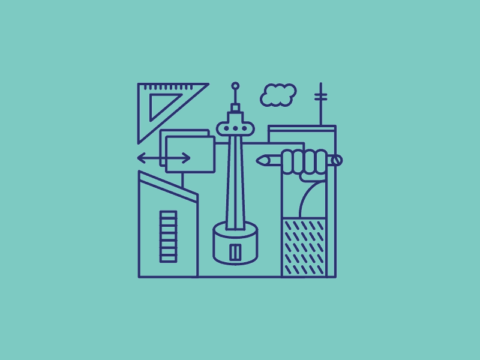
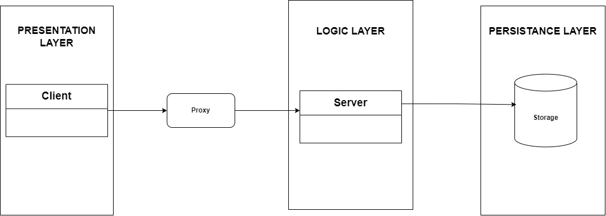

    

# Architectural Specification

## Contents

1. [Introduction](#Introduction)
2. [Design Strategy](#Design-Strategy-)
3. [Quality Requirements](#Quality-Requirements-)
4. [Architectural Patterns](#Architectural-Patterns-)
5. [Technology Choices](#Technology-Choices-)
6. [Architectural Constraints](#Architectural-Constraints-)

# Introduction

The Republic is a platform aimed at revolutionizing citizen engagement with government services. This document outlines the architectural design of The Republic project, focusing on the system's performance, scalability, reliability, security, maintainability, and usability while facilitating future evolution from a monolithic to a microservice architecture.

# Design Strategy 📃

## Alignment with Business Requirements:

The architectural decisions and identification of quality requirements were made to directly align with the core business requirements of The Republic project. The functional requirements and user stories outline the need for a platform that allows citizens to report governmental service delivery issues and visualize the aggregated data. To meet these business needs effectively, the architectural choices and prioritized quality requirements were carefully selected.

Furthermore, the prioritization of quality requirements such as performance, reliability, scalability, security, and usability directly addresses the business need for a robust, responsive, and user-friendly platform capable of handling a large user base. By ensuring high performance, reliability, and scalability, the system can effectively serve the intended audience of the general public, facilitating seamless reporting of service delivery issues and providing insightful visualizations.
The emphasis on security and usability aligns with the business requirement of fostering trust and encouraging widespread adoption among citizens. A secure platform that protects user data and provides an intuitive user experience will be crucial for the project's success and sustained utilization.

## User-Centric Design:

As the platform targets the general public, including individuals from diverse backgrounds and demographics, addressing their requirements is important. Key considerations include:

- **Intuitive User Experience:** Prioritizing usability ensures that the platform is easy to navigate and interact with, regardless of the user's technical proficiency or ability. This aligns with the quality requirement of delivering a user-friendly experience that encourages widespread adoption.
- **Accurate and Relevant Information:** By emphasizing reliability and performance, the platform can provide citizens with accurate and up-to-date visualizations and insights into governmental service delivery. This transparency and information accuracy foster trust and enable informed decision-making.
- **Consistent Availability:** Aligning with the reliability quality requirement, the system must remain consistently accessible and operational, especially during critical situations when citizens need to report service delivery issues promptly.
- **Responsive Interactions:** Focusing on performance ensures that the platform responds swiftly to user inputs, queries, and interactions, providing a seamless and efficient experience that meets citizens' expectations for responsiveness.

This user-centric approach not only enhances the overall experience but also increases the likelihood of sustained engagement and utilization, aligning with the overarching business objectives of the project.

## Facilitates Long-term Maintenance:

By prioritizing aspects such as modularity, code quality, and comprehensive documentation, the system can be effectively maintained and evolved over time. Specific considerations include:

- **Modular Design:** Structuring the application into independent, self-contained modules or components promotes maintainability. This modular approach simplifies the process of updating, replacing, or extending specific functionalities without compromising the entire system's integrity.
- **Robust Coding Practices:** Adherence to industry-standard coding conventions, rigorous code reviews, and automated testing frameworks contribute to a high-quality, maintainable codebase. This proactive approach minimizes technical debt and facilitates efficient identification and resolution of issues.
- **Comprehensive Documentation:** Maintaining detailed and up-to-date documentation not only aids in knowledge transfer among development teams but also serves as a valuable resource for future maintenance and enhancement efforts. Well-documented code, architecture, and processes ensure smoother transitions and minimize the risk of disruptions.

While strategies like decomposition and test case generation are undoubtedly valuable and will be employed throughout the project lifecycle, the primary architectural design strategy centers on addressing key quality requirements.

# Quality Requirements 📋

The following Quality Requirements have been identified by the team and the client. They are listed in order of importance and discussed in some detail below.

- **1. Performance**
- **2. Reliability**
- **3. Scalability**
- **4. Security**
- **5. Usability**

## Performance 🚀

Performance requirements ensure that the system can handle a high volume of users and interactions without significant latency. The system must maintain high speed and responsiveness even under load.

- **Caching:** Implementing caching strategies at multiple levels to reduce load times and improve response speeds. Frequently accessed data is cached to minimize database queries.
- **Load Balancing:** Using load balancers to distribute incoming traffic evenly across multiple servers. This ensures that no single server becomes a bottleneck, maintaining system performance even during peak usage.
- **Optimized Queries:** Database queries are optimized to handle large volumes of data efficiently. Indexing and query optimization techniques are employed to ensure quick data retrieval.

| Stimulus Source                                               | Stimulus                                                                | Response                                                                                                                                            | Response Measure                                                                                                               | Environment                           | Artifact                                   |
| ------------------------------------------------------------- | ----------------------------------------------------------------------- | --------------------------------------------------------------------------------------------------------------------------------------------------- | ------------------------------------------------------------------------------------------------------------------------------ | ------------------------------------- | ------------------------------------------ |
| High number of concurrent users / High volume of interactions | User actions like creating posts, uploading media, and filtering posts. | - Implement caching strategies.  - Use load balancers to distribute traffic.  - Optimize database queries.  - Monitor performance metrics. | - Average response time under load (e.g., <200ms).  - System handles peak load without significant performance degradation. | High user activity / Peak usage times | User interaction points, database queries. |

## Reliability 🛡️

Reliability ensures that the system is available and functional when users need it. Users should be able to perform critical tasks like creating accounts, posting, or resetting passwords without issues.

- **Redundancy:** Critical components must have redundant systems in place to handle failures gracefully. This includes redundant servers, databases, and network connections.
- **Backups:** Regular backups of all critical data ensure that data can be restored quickly in case of a failure, minimizing downtime and data loss.

| Stimulus Source              | Stimulus                                                     | Response                                                                                                                                                                   | Response Measure                                                                                                                                                                                   | Environment                                    | Artifact                                               |
| ---------------------------- | ------------------------------------------------------------ | -------------------------------------------------------------------------------------------------------------------------------------------------------------------------- | -------------------------------------------------------------------------------------------------------------------------------------------------------------------------------------------------- | ---------------------------------------------- | ------------------------------------------------------ |
| System demand/ User Activity | User attempts to create accounts, log in, or reset passwords | - The system should have high uptime and minimal downtime.   - Implement redundancy to handle failures gracefully.   - Perform regular backups to prevent data loss. | - System uptime percentage (99.9%).  - Successful completion of critical user actions (account creation success rate above 99%).  - Minimal downtime incidents (less than 1 hour per month). | System operating normally / During maintenance | User authentication and account management components. |

## Scalability 📈

The system is built to scale efficiently to handle growth in users, data, and complexity.

- **Microservices Architecture:** Although currently using a monolithic design, the system is planned to transition to a microservices architecture. This will allow different functionalities to be managed independently and scaled as needed.
- **Horizontal Scaling:** Services are designed to scale horizontally by adding more instances to handle increased load, ensuring that performance remains stable as the user base grows.
- **Database Partitioning:** Employing database partitioning and sharding to manage data growth efficiently. This ensures that large datasets are handled effectively without degrading performance.

| Stimulus Source                          | Stimulus                               | Response                                                                                                                            | Response Measure                                                                                                                  | Environment                                | Artifact                                                      |
| ---------------------------------------- | -------------------------------------- | ----------------------------------------------------------------------------------------------------------------------------------- | --------------------------------------------------------------------------------------------------------------------------------- | ------------------------------------------ | ------------------------------------------------------------- |
| Increasing number of users / Data growth | Addition of new users, posts, and data | - Design for horizontal scaling.  - Plan transition to microservices architecture.  - Use database partitioning and sharding. | - Stable performance with growing user base.  - Efficient data handling.  - Seamless addition of new services and features. | Growing user base / Increasing data volume | Core functionalities like post management and data analytics. |

## Security 🔒

The system addresses the crucial attribute of security with a comprehensive, layered approach to protect sensitive data and ensure secure user interactions.

- **Entry Point Validation:** At the initial entry point, all incoming requests are validated and sanitized to defend against malformed or malicious data. This serves as the first line of defense, preventing potentially harmful requests from reaching deeper layers of the system.
- **Service-Level Security:** Within the system, individual services such as User Management enforce strict access controls. Only users with the correct permissions can access or modify sensitive information. For example, the User Management service uses a dedicated PostgreSQL database with role-based access control to ensure that sensitive user data is protected.
- **Data Storage Security:** The system ensures that sensitive information is masked, and access is restricted to read-only where appropriate, thus maintaining data integrity and confidentiality. Additionally, compliance with data protection regulations, such as the POPI Act, is ensured by implementing necessary data masking and encryption protocols.

| Stimulus Source                       | Stimulus                                                          | Response                                                                                                                                                                                  | Response Measure                                                                                                                                               | Environment             | Artifact                                                    |
| ------------------------------------- | ----------------------------------------------------------------- | ----------------------------------------------------------------------------------------------------------------------------------------------------------------------------------------- | -------------------------------------------------------------------------------------------------------------------------------------------------------------- | ----------------------- | ----------------------------------------------------------- |
| Malicious actors / Unauthorized users | Attempts to access sensitive data or perform unauthorized actions | - Validate and sanitize incoming requests.  - Use token-based middleware for session management.  - Implement role-based access control.  - Encrypt data at rest and in transit. | - Unauthorized access attempts identified and flagged.  - Only authorized users access sensitive data.  - No unauthorized modifications to the database. | System running normally | API endpoints, data access layers, user management service. |

## Usability 🖐️

Usability ensures that the system is easy to use and provides a good user experience for users of all backgrounds.

- **Intuitive UI/UX:** Designing interfaces that are intuitive and easy to navigate. Users can perform necessary actions effortlessly, even without prior training.

| Stimulus Source             | Stimulus                                     | Response                                                                                                | Response Measure                                                                             | Environment  | Artifact                                       |
| --------------------------- | -------------------------------------------- | ------------------------------------------------------------------------------------------------------- | -------------------------------------------------------------------------------------------- | ------------ | ---------------------------------------------- |
| User interaction / Feedback | User attempts to navigate and use the system | - Design intuitive and accessible user interfaces.  - Provide clear instructions and help resources. | - Number of usability-related issues reported.  - Time taken for users to complete tasks. | Normal usage | User interface and user experience components. |

## Maintainability 🔧

Maintainability ensures that the system can be easily updated and improved over time.

- **Modular Code:** Writing clean, modular code to simplify updates and enhancements. Each module can be developed, tested, and maintained independently.
- **Documentation:** Comprehensive and up-to-date documentation is maintained for developers and users, ensuring that the system is easy to understand and modify.
- **CI/CD Practices:** Implementing continuous integration and continuous deployment (CI/CD) practices to streamline development and deployment processes. This allows for frequent updates and quick delivery of new features.

| Stimulus Source                         | Stimulus                                                    | Response                                                                                                  | Response Measure                                                                                                                             | Environment                           | Artifact                                          |
| --------------------------------------- | ----------------------------------------------------------- | --------------------------------------------------------------------------------------------------------- | -------------------------------------------------------------------------------------------------------------------------------------------- | ------------------------------------- | ------------------------------------------------- |
| Need for updates / New feature requests | Introduction of new features, bug fixes, and system updates | - Write clean, modular code.  - Maintain comprehensive documentation.  - Implement CI/CD practices. | - Time taken to implement updates and new features.  - Ease of identifying and fixing issues.  - Minimal disruption during deployment. | Ongoing development / Regular updates | Codebase, documentation, and deployment pipeline. |

# Architectural Patterns 🔨

## Layered Pattern

A layered architecture can help improve performance by separating concerns, allowing for optimization at each layer. Each layer has a well-defined responsibility, ensuring cleaner code and easier maintenance. The presentation layer handles the user interface, the logic layer manages business rules, and the data access layer interacts with the database. Security can be ensured at multiple levels as well thus improving security.

## Micro-Services

Microservices architecture can enhance reliability by isolating failures to specific services, preventing a single point of failure and it supports horizontal scaling, improving scalability.

## Components Based Pattern

Our frontend utilizes a component-based architecture, allowing for the reuse of individual components across different parts of the application. This approach minimizes code duplication and enhances the consistency of the user interface. Each component is designed to be independently testable, aligning with our structural style and test-driven development methodology.

## Client-Server Pattern

Our system is designed using a client-server architecture. In this setup, the frontend acts as a client that requests data from the backend server. The backend server then provides content to multiple clients. This separation of frontend and backend components allows them to function independently, facilitating easier testing of individual components due to their loose coupling.

- **User Management:** The backend server manages user authentication, registration, and profile management functionality through a User Management Service. This service would handle user-related data and enforce access controls.
- **Post Management:** This service is responsible for managing user posts, comments, reactions, and providing filtering/sorting functionality for the posts.
- **Data Analytics and Visualization:** This component performs sentiment analysis on user posts, processes the data, and generates visualizations based on the analyzed data. It may utilize machine learning models or data processing pipelines to extract insights from the user-generated content.
- **Security and Access Control:** The backend server is responsible for implementing security measures, such as entry point validation, token-based middleware for session management, and enforcing role-based access controls to protect sensitive data and ensure authorized access.
- **Database Management:** The backend server manages the interactions with the primary database for storing and retrieving data related to users, posts, and other application data.

<!--## Architecture Diagram

-->

## Future Migration to Microservices Architecture

As our project evolves, we aim to transition from the current monolithic architecture to a microservices architecture. This strategic shift will enhance our system's scalability, maintainability, and resilience, allowing us to better meet the growing demands and complexity of our application.

# Technology Choices 💭

## Frontend Technologies

## **NextJs**

  

Next.js is a React framework that enables server-side rendering and static site generation. It simplifies the creation of dynamic web applications and enhances SEO.

### **Pros:**

- Server-Side Rendering (SSR) and Static Site Generation (SSG)
- Built-in routing and CSS support
- Optimized for performance

### **Cons:**

- Requires server for SSR
- Learning curve for advanced features

### **Fit with Architecture**

- SSR reduces client-side processing, improving performance during high user activity.

---

### **React**

  

React is a JavaScript library for building user interfaces with a component-based approach. It’s highly popular and widely used.

### **Pros:**

- Large ecosystem and community support
- Supports a component-based architecture

### **Cons:**

- Requires additional setup for SSR (using frameworks like Next.js)
- Steep learning curve for beginners

### **Fit with Architecture**

- Enables rapid development of interactive and responsive user interfaces, improving user experience during high interaction.

---

### **SvelteKit**

  

SvelteKit is a framework for building web applications using Svelte. It offers both server-side rendering and static site generation.

### **Pros:**

- Optimized for performance
- Built-in SSR and SSG

### **Cons:**

- Smaller community compared to React
- Less mature ecosystem

### **Fit with Architecture**

- Highly efficient rendering and smaller bundle sizes ensure faster response times.

---

### Final Choice

We picked React for its component-based architecture, performance benefits, and strong community support, ensuring we can build a robust and scalable user interface. We also chose Next.js due to its ability to enhance performance through SSR and SSG, its seamless integration with React, and its flexibility in building complex, scalable frontend applications.

## Backend Technologies

## **NodeJs with ExpressJs**

  
  

Node.js is a runtime that allows JavaScript to be used on the server-side. Express.js is a minimal and flexible Node.js web application framework.

### **Pros:**

- Efficient handling of multiple requests.
- Simplifies development by using JavaScript on both frontend and backend.
- Rich set of libraries and tools via npm.

### **Cons:**

- Can lead to complex and hard-to-maintain code.
- Not suitable for CPU-intensive operations.

### **Fit with Architecture**

- Asynchronous nature and event-driven architecture ensure efficient handling of multiple requests.

---

## **Java with Spring Boot**

  

Spring Boot is an extension of the Spring framework that simplifies the development of new Spring applications. It provides a wide range of features for building modern web applications.

### **Pros:**

- Robust and mature ecosystem
- Support for microservices architecture

### **Cons:**

- Heavier compared to Node.js
- Steeper learning curve

### **Fit with Architecture**

- Provides robust tools for handling critical operations and maintaining high uptime.

---

## **.NET**

  

.NET Core is a cross-platform, high-performance framework for building modern, cloud-based, internet-connected applications.

### **Pros:**

- High performance and scalability
- Cross-platform

### **Cons:**

- Requires knowledge of C#

### **Fit with Architecture**

- Designed to scale efficiently and handle increased loads seamlessly.

---

### Final Choice

Node.js was picked for its non-blocking, event-driven architecture, which fits our performance and scalability requirements and
Express.js for its simplicity and efficiency in building RESTful APIs, aligning with our microservices approach and maintainability needs.

## Data Science Technologies

## **Python via Django**

  
  

Django is a high-level Python web framework that encourages rapid development and clean, pragmatic design. It is well-suited for data science applications due to Python's extensive libraries and frameworks.

### **Pros:**

- Django's "batteries-included" philosophy means it comes with many built-in features, reducing the need for third-party plugins.
- Django provides robust security features to protect against common threats.

### **Cons:**

- While Django simplifies many tasks, it can still be complex for beginners.
- The full-stack nature of Django may introduce overhead for simpler applications.

### **Fit with Architecture**

- Django, combined with Python's data science libraries, can handle intensive data processing and analysis efficiently.

---

## **R**

  

R is a programming language and environment specifically designed for statistical computing and graphics. It is widely used in academia and industry for data analysis.

### **Pros:**

- Extensive support for statistical methods and data visualization.
- Advanced data visualization capabilities with libraries like ggplot2.

### **Cons:**

- Can be slower than Python for certain tasks.
- Less straightforward integration with web applications compared to Python.

### **Fit with Architecture**

- Provides robust statistical tools but may need integration with other systems for performance improvements.

---

## **Apache Spark**

  

Apache Spark is an open-source unified analytics engine for big data processing, with built-in modules for streaming, SQL, machine learning, and graph processing.

### **Pros:**

- Designed to handle large-scale data processing.
- In-memory data processing capabilities significantly speed up computations.

### **Cons:**

- Can be complex to set up and manage.
- Requires significant resources for optimal performance.

### **Fit with Architecture**

- Efficiently handles and processes large datasets, ensuring quick response times during peak usage.

---

### Final Choice

Python's extensive data science libraries combined with Django's robust framework provide a comprehensive solution for data analytics and visualization needs. This choice ensures rapid development, scalability, and maintainability.

## Database Technologies

## **PostgreSQL**

  

PostgreSQL is a powerful, open-source object-relational database system with over 30 years of active development. It is known for its robustness, performance, and advanced features.

### **Pros:**

- Supports complex queries, indexing, and full ACID compliance.
- Highly extensible with support for custom functions and data types.

### **Cons:**

- Can be complex to manage for beginners.
- Requires careful tuning for optimal performance in high-load scenarios.

### **Fit with Architecture**

- Efficient indexing and query optimization ensure quick data retrieval and processing.

---

## **MySQL**

  

MySQL is an open-source relational database management system known for its reliability, ease of use, and performance.

### **Pros:**

- High-performance capabilities, especially for read-heavy workloads.
- Simple to set up and manage.

### **Cons:**

- Lacks some advanced features compared to PostgreSQL.
- May require additional tools and configurations for handling very large datasets.

### **Fit with Architecture**

- Performs well for read-heavy operations but might require additional tools for high scalability.

---

## **MongoDB**

  

MongoDB is a NoSQL database that uses a document-oriented data model. It is known for its flexibility and scalability.

### **Pros:**

- Designed to scale out horizontally.
- Schema-less design allows for flexible data models.

### **Cons:**

- Trades off consistency for performance in certain scenarios.
- Less efficient for complex queries compared to relational databases.

### **Fit with Architecture**

- Excels in environments with rapidly changing data and high write loads, ensuring quick adaptation and performance.

---

### Final Choice

PostgreSQL's advanced features, scalability, and robustness make it the ideal choice for handling the data management needs. Its strong support for complex queries, indexing, and data integrity aligns well with our architectural requirements for reliability, performance, and security.

# Architectural Constraints ⚠️

<!--- **Monolithic Architecture Transition** 
  The system is initially designed using a monolithic architecture with plans to transition to a microservices architecture in the future to enhance scalability and maintainability. -->

- **Deployment Model** 
  The system must not follow a serverless model and should not be cloud-native. It must be able to run on one or more Linux virtual machines (VMs).

- **Library and Service Restrictions** 
  All libraries and services used within the system must be open source to ensure transparency, security, and cost-efficiency.

- **Database Requirement** 
  The system uses PostgreSQL as the primary database due to its robustness, scalability, and support for complex queries and transactions.

- **Compliance with POPIA** 
  The system must comply with the Protection of Personal Information Act (POPIA) in South Africa, necessitating secure handling of personal data and stringent access controls.

[Back](./../README.md) 
[Back to main](/README.md)

---
