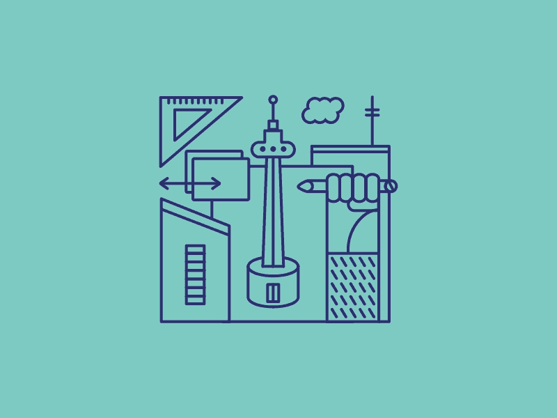

    

# Architectural Specification

## Contents

1. [Introduction](#Introduction)
2. [Design Strategy](#Design-Strategy-)
3. [Quality Requirements](#Quality-Requirements-)
4. [Architectural Patterns](#Architectural-Patterns-)
5. [Technology Choices](#Technology-Choices-)
6. [Architectural Constraints](#Architectural-Constraints-)

# Introduction

The Republic is a platform aimed at revolutionizing citizen engagement with government services. This document outlines the architectural design of The Republic project, focusing on the system's performance, scalability, reliability, security, maintainability, and usability while facilitating future evolution from a monolithic to a microservice architecture.

# Design Strategy 📃

## Alignment with Business Requirements:

The architectural decisions and identification of quality requirements were made to directly align with the core business requirements of The Republic project. The functional requirements and user stories outline the need for a platform that allows citizens to report governmental service delivery issues and visualize the aggregated data. To meet these business needs effectively, the architectural choices and prioritized quality requirements were carefully selected.

Furthermore, the prioritization of quality requirements such as performance, reliability, scalability, security, and usability directly addresses the business need for a robust, responsive, and user-friendly platform capable of handling a large user base. By ensuring high performance, reliability, and scalability, the system can effectively serve the intended audience of the general public, facilitating seamless reporting of service delivery issues and providing insightful visualizations.
The emphasis on security and usability aligns with the business requirement of fostering trust and encouraging widespread adoption among citizens. A secure platform that protects user data and provides an intuitive user experience will be crucial for the project's success and sustained utilization.

## User-Centric Design:

As the platform targets the general public, including individuals from diverse backgrounds and demographics, addressing their requirements is important. Key considerations include:

- **Intuitive User Experience:** Prioritizing usability ensures that the platform is easy to navigate and interact with, regardless of the user's technical proficiency or ability. This aligns with the quality requirement of delivering a user-friendly experience that encourages widespread adoption.
- **Accurate and Relevant Information:** By emphasizing reliability and performance, the platform can provide citizens with accurate and up-to-date visualizations and insights into governmental service delivery. This transparency and information accuracy foster trust and enable informed decision-making.
- **Consistent Availability:** Aligning with the reliability quality requirement, the system must remain consistently accessible and operational, especially during critical situations when citizens need to report service delivery issues promptly.
- **Responsive Interactions:** Focusing on performance ensures that the platform responds swiftly to user inputs, queries, and interactions, providing a seamless and efficient experience that meets citizens' expectations for responsiveness.

This user-centric approach not only enhances the overall experience but also increases the likelihood of sustained engagement and utilization, aligning with the overarching business objectives of the project.

## Facilitates Long-term Maintenance:

By prioritizing aspects such as modularity, code quality, and comprehensive documentation, the system can be effectively maintained and evolved over time. Specific considerations include:

- **Modular Design:** Structuring the application into independent, self-contained modules or components promotes maintainability. This modular approach simplifies the process of updating, replacing, or extending specific functionalities without compromising the entire system's integrity.
- **Robust Coding Practices:** Adherence to industry-standard coding conventions, rigorous code reviews, and automated testing frameworks contribute to a high-quality, maintainable codebase. This proactive approach minimizes technical debt and facilitates efficient identification and resolution of issues.
- **Comprehensive Documentation:** Maintaining detailed and up-to-date documentation not only aids in knowledge transfer among development teams but also serves as a valuable resource for future maintenance and enhancement efforts. Well-documented code, architecture, and processes ensure smoother transitions and minimize the risk of disruptions.

While strategies like decomposition and test case generation are undoubtedly valuable and will be employed throughout the project lifecycle, the primary architectural design strategy centers on addressing key quality requirements.

# Quality Requirements

## 1. Performance

Performance in our system is crucial for handling high volumes of user posts and data analysis requests efficiently.

### Key Implementations:
- **Load Balancing:** We utilize Heroku's built-in load balancer to distribute traffic across multiple backend instances. This automatically scales by launching new instances when necessary, ensuring consistent performance during traffic spikes.

- **Client-side Caching:** Our frontend implements client-side caching strategies to reduce server load and improve response times. This is particularly effective for frequently accessed data like user profiles or common complaint categories.

- **Request Deduplication:** To minimize redundant processing, we've implemented request deduplication on the backend. This is especially useful for preventing duplicate submissions when users double-click submit buttons or experience network issues.

- **Pagination and Prefetching:** For large datasets, such as extensive complaint lists or complex data visualizations, we use pagination to limit the amount of data transferred in a single request. We also implement prefetching to anticipate and prepare upcoming data requests, reducing perceived loading times.

### Performance Scenario:
During a major government service outage, our system experiences a sudden influx of 10,000 concurrent users trying to submit complaints and view service status updates.

**Response:**
- The Heroku load balancer distributes incoming requests across multiple backend instances.
- Client-side caching serves frequently accessed data like service status updates without hitting the server.
- Request deduplication prevents duplicate complaint submissions from users frantically clicking the submit button.
- Pagination ensures that the system only loads manageable chunks of complaint data at a time, while prefetching prepares the next set of data.

**Measure:** 
- 95% of API requests are processed within 500ms.
- Complex data visualizations render within 3 seconds.

## 2. Reliability

Reliability ensures our system remains available and functional for users to post complaints and access data consistently.

### Key Implementations:
- **Multiple Backend Instances:** We run multiple instances of our backend on Heroku, providing redundancy in case of individual instance failures.

- **Supabase Replication:** We leverage Supabase's built-in replication features for our database, ensuring data consistency and availability even if one database node fails.

### Reliability Scenario:
During a planned maintenance window, one of our backend instances goes offline.

**Response:**
- Incoming requests are automatically routed to the remaining active instances by Heroku's load balancer.
- Supabase replication ensures that all data remains consistent and accessible across the database cluster.

**Measure:**
- The system maintains 99.9% uptime.
- No data loss occurs during the instance downtime.

## 3. Scalability

Our system is designed to handle growth in users, posts, and data analysis requirements efficiently.

### Key Implementations:
- **Heroku and Vercel Scaling:** We utilize Heroku's dynamic scaling for our backend and Vercel's serverless architecture for our frontend. This allows us to automatically adjust resources based on demand.

- **Future Microservices Architecture:** While currently monolithic, our system is designed with a future transition to microservices in mind. This will allow different functionalities to scale independently as needed.

### Scalability Scenario:
Our user base doubles over a weekend due to a viral social media post about government services.

**Response:**
- Heroku automatically scales our backend instances to handle the increased load.
- Vercel's serverless architecture ensures the frontend remains responsive despite the traffic surge.
- Our design allows for easy transition to a microservices architecture if sustained growth requires it.

**Measure:**
- The system maintains performance while handling up to 1 million concurrent users.
- Data processing and analysis capabilities scale to handle at least 10 million user posts.

## 4. Security

Security is paramount in our system to protect user data and ensure secure interactions.

### Key Implementations:
- **JWT Authentication:** We use JSON Web Tokens (JWT) for secure user authentication and session management.

- **HTTPS:** All data transmissions are encrypted using HTTPS to prevent man-in-the-middle attacks.

- **User ID Obfuscation:** We hide or obfuscate user IDs in public-facing areas of the application to enhance user privacy.

- **Nginx Proxy:** We utilize Nginx as a reverse proxy, leveraging its additional security features like rate limiting and request filtering.

### Security Scenario:
A malicious actor attempts to gain unauthorized access to user data through a series of automated attacks.

**Response:**
- JWT verification fails for all unauthorized access attempts.
- All data remains encrypted in transit due to HTTPS implementation.
- User IDs remain obfuscated, preventing the attacker from easily targeting specific users.
- Nginx proxy detects and blocks suspicious request patterns.

**Measure:**
- Zero successful unauthorized data access attempts.
- All sensitive data remains encrypted in transit and at rest.

## 5. Usability

Usability ensures our system provides a positive user experience across various devices and user capabilities.

### Key Implementations:
- **Intuitive Frontend Components:** We've carefully designed our UI components to provide intuitive navigation and interaction.

- **Responsive Design:** Our application adapts seamlessly to different screen sizes, ensuring usability on both mobile devices and desktop computers.

- **Consistent Theming:** We implement a consistent visual theme throughout the application for a cohesive user experience.

- **User-Centric Design:** Our UX prioritizes ease of use for core functionalities like submitting complaints and viewing data visualizations.

### Usability Scenario:
A new user accesses our system for the first time on a mobile device to submit a complaint about a local government service.

**Response:**
- Intuitive frontend components guide the user through the complaint submission process.
- Responsive design ensures all elements are properly sized and positioned on the mobile screen.
- Consistent theming provides a professional and trustworthy appearance.
- Streamlined UX allows the user to submit their complaint with minimal steps.

**Measure:**
- User satisfaction score of at least 4 out of 5 in post-interaction surveys.
- Successful complaint submission rate of over 90% for first-time users.

# Architectural Patterns 🔨
- TO DO (HAS TO BE UPDATED)

## Architecture Diagram
- TO DO (HAS TO BE UPDATED)

# Technology Choices 💭

## **Frontend Technologies**

### **NextJs**

  

Next.js is a React framework that enables server-side rendering and static site generation. It simplifies the creation of dynamic web applications and enhances SEO.

### **Pros:**

- Server-Side Rendering (SSR) and Static Site Generation (SSG)
- Built-in routing and CSS support
- Optimized for performance

### **Cons:**

- Requires server for SSR
- Learning curve for advanced features

### **Fit with Architecture**

- SSR reduces client-side processing, improving performance during high user activity.

---

### **React**

  

React is a JavaScript library for building user interfaces with a component-based approach. It’s highly popular and widely used.

### **Pros:**

- Large ecosystem and community support
- Supports a component-based architecture

### **Cons:**

- Requires additional setup for SSR (using frameworks like Next.js)
- Steep learning curve for beginners

### **Fit with Architecture**

- Enables rapid development of interactive and responsive user interfaces, improving user experience during high interaction.

---

### **SvelteKit**

  

SvelteKit is a framework for building web applications using Svelte. It offers both server-side rendering and static site generation.

### **Pros:**

- Optimized for performance
- Built-in SSR and SSG

### **Cons:**

- Smaller community compared to React
- Less mature ecosystem

### **Fit with Architecture**

- Highly efficient rendering and smaller bundle sizes ensure faster response times.

---

## Final Choice

We picked Next.js for its component-based architecture, performance benefits, and strong community support, ensuring we can build a robust and scalable user interface. We also chose Next.js due to its ability to enhance performance through SSR and SSG, its seamless integration with React, and its flexibility in building complex, scalable frontend applications.

## **Backend Technologies**

### **NodeJs with ExpressJs**

  
  

Node.js is a runtime that allows JavaScript to be used on the server-side. Express.js is a minimal and flexible Node.js web application framework.

### **Pros:**

- Efficient handling of multiple requests.
- Simplifies development by using JavaScript on both frontend and backend.
- Rich set of libraries and tools via npm.

### **Cons:**

- Can lead to complex and hard-to-maintain code.
- Not suitable for CPU-intensive operations.

### **Fit with Architecture**

- Asynchronous nature and event-driven architecture ensure efficient handling of multiple requests.

---

### **Java with Spring Boot**

  

Spring Boot is an extension of the Spring framework that simplifies the development of new Spring applications. It provides a wide range of features for building modern web applications.

### **Pros:**

- Robust and mature ecosystem
- Support for microservices architecture

### **Cons:**

- Heavier compared to Node.js
- Steeper learning curve

### **Fit with Architecture**

- Provides robust tools for handling critical operations and maintaining high uptime.

---

### **.NET**

  

.NET Core is a cross-platform, high-performance framework for building modern, cloud-based, internet-connected applications.

### **Pros:**

- High performance and scalability
- Cross-platform

### **Cons:**

- Requires knowledge of C#

### **Fit with Architecture**

- Designed to scale efficiently and handle increased loads seamlessly.

---

## Final Choice

Express.js was picked for its non-blocking, event-driven architecture, which fits our performance and scalability requirements and also has the
the benefit of simplicity and efficiency in building RESTful APIs, aligning with our microservices approach and maintainability needs.

## **Data Science Technologies**

### **Python via Django**

  
  

Django is a high-level Python web framework that encourages rapid development and clean, pragmatic design. It is well-suited for data science applications due to Python's extensive libraries and frameworks.

### **Pros:**

- Django's "batteries-included" philosophy means it comes with many built-in features, reducing the need for third-party plugins.
- Django provides robust security features to protect against common threats.

### **Cons:**

- While Django simplifies many tasks, it can still be complex for beginners.
- The full-stack nature of Django may introduce overhead for simpler applications.

### **Fit with Architecture**

- Django, combined with Python's data science libraries, can handle intensive data processing and analysis efficiently.

---

### **R**

  

R is a programming language and environment specifically designed for statistical computing and graphics. It is widely used in academia and industry for data analysis.

### **Pros:**

- Extensive support for statistical methods and data visualization.
- Advanced data visualization capabilities with libraries like ggplot2.

### **Cons:**

- Can be slower than Python for certain tasks.
- Less straightforward integration with web applications compared to Python.

### **Fit with Architecture**

- Provides robust statistical tools but may need integration with other systems for performance improvements.

---

### **Apache Spark**

  

Apache Spark is an open-source unified analytics engine for big data processing, with built-in modules for streaming, SQL, machine learning, and graph processing.

### **Pros:**

- Designed to handle large-scale data processing.
- In-memory data processing capabilities significantly speed up computations.

### **Cons:**

- Can be complex to set up and manage.
- Requires significant resources for optimal performance.

### **Fit with Architecture**

- Efficiently handles and processes large datasets, ensuring quick response times during peak usage.

---

## Final Choice

Python's extensive data science libraries combined with Django's robust framework provide a comprehensive solution for data analytics and visualization needs. This choice ensures rapid development, scalability, and maintainability.

## **Database Technologies**

### **PostgreSQL**

  

PostgreSQL is a powerful, open-source object-relational database system with over 30 years of active development. It is known for its robustness, performance, and advanced features.

### **Pros:**

- Supports complex queries, indexing, and full ACID compliance.
- Highly extensible with support for custom functions and data types.

### **Cons:**

- Can be complex to manage for beginners.
- Requires careful tuning for optimal performance in high-load scenarios.

### **Fit with Architecture**

- Efficient indexing and query optimization ensure quick data retrieval and processing.

---

### **MySQL**

  

MySQL is an open-source relational database management system known for its reliability, ease of use, and performance.

### **Pros:**

- High-performance capabilities, especially for read-heavy workloads.
- Simple to set up and manage.

### **Cons:**

- Lacks some advanced features compared to PostgreSQL.
- May require additional tools and configurations for handling very large datasets.

### **Fit with Architecture**

- Performs well for read-heavy operations but might require additional tools for high scalability.

---

### **MongoDB**

  

MongoDB is a NoSQL database that uses a document-oriented data model. It is known for its flexibility and scalability.

### **Pros:**

- Designed to scale out horizontally.
- Schema-less design allows for flexible data models.

### **Cons:**

- Trades off consistency for performance in certain scenarios.
- Less efficient for complex queries compared to relational databases.

### **Fit with Architecture**

- Excels in environments with rapidly changing data and high write loads, ensuring quick adaptation and performance.

---

## Final Choice

PostgreSQL's advanced features, scalability, and robustness make it the ideal choice for handling the data management needs. Its strong support for complex queries, indexing, and data integrity aligns well with our architectural requirements for reliability, performance, and security.

# Architectural Contraints ⚠️

<!--- **Monolithic Architecture Transition** 
  The system is initially designed using a monolithic architecture with plans to transition to a microservices architecture in the future to enhance scalability and maintainability. -->

- **Deployment Model** 
  The system must not follow a serverless model and should not be cloud-native. It must be able to run on one or more Linux virtual machines (VMs).

- **Library and Service Restrictions** 
  All libraries and services used within the system must be open source to ensure transparency, security, and cost-efficiency.

- **Database Requirement** 
  The system uses PostgreSQL as the primary database due to its robustness, scalability, and support for complex queries and transactions.

- **Compliance with POPIA** 
  The system must comply with the Protection of Personal Information Act (POPIA) in South Africa, necessitating secure handling of personal data and stringent access controls.

[Back](./../README.md) 
[Back to main](/README.md)

---
