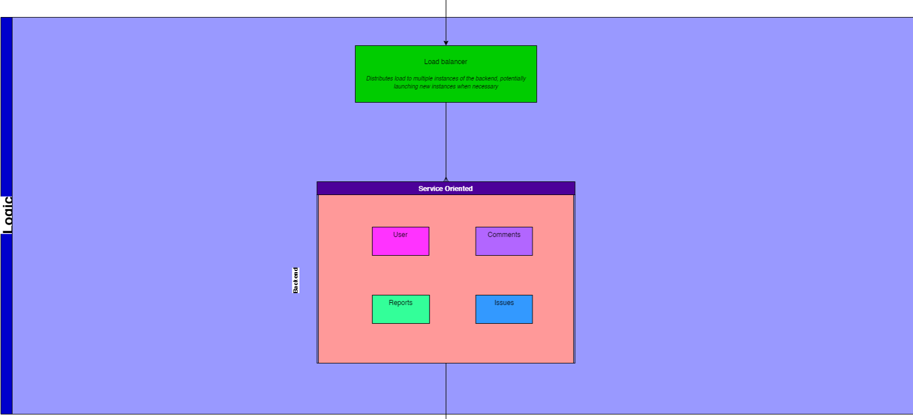

# Architectural Specification

## Contents

1. [Introduction](#introduction)
2. [Design Strategy](#design-strategy-)
3. [Quality Requirements](#quality-requirements)
4. [Architectural Patterns](#architectural-patterns-)
5. [Technology Choices](#technology-choices-)
6. [Architectural Constraints](#architectural-constraints-)

# Introduction

The Republic is an innovative platform designed to revolutionize citizen engagement with government services. This document outlines the architectural design of The Republic project, focusing on crucial aspects such as system performance, scalability, reliability, security, maintainability, and usability. Additionally, it lays the groundwork for a future evolution from a monolithic to a microservice architecture, ensuring the system's long-term adaptability and growth.

# Design Strategy 📃

## Alignment with Business Requirements

The architectural decisions and identification of quality requirements have been carefully crafted to directly align with the core business requirements of The Republic project. The functional requirements and user stories highlight the need for a robust platform that enables citizens to report governmental service delivery issues and visualize aggregated data effectively.

To meet these business needs, we've prioritized the following aspects:

1. **Performance and Scalability**: Ensuring the platform can handle a large user base and process substantial amounts of data efficiently.
2. **Reliability**: Guaranteeing consistent availability and accuracy of the system, especially during peak usage periods.
3. **Security**: Protecting user data and maintaining trust in the platform.
4. **Usability**: Providing an intuitive and accessible interface for users from diverse backgrounds.

By focusing on these quality requirements, we address the business need for a responsive, trustworthy, and user-friendly platform that can effectively serve the general public.

## User-Centric Design

As The Republic targets a diverse audience encompassing the general public, addressing their varied requirements is paramount. Key considerations in our user-centric design approach include:

1. **Intuitive User Experience**: We prioritize usability to ensure that the platform is easy to navigate and interact with, regardless of the user's technical proficiency or abilities. This aligns with our quality requirement of delivering a user-friendly experience that encourages widespread adoption.

   Example: Implementing a step-by-step guided process for submitting service delivery issues, with clear instructions and visual cues at each stage.

2. **Accurate and Relevant Information**: By emphasizing reliability and performance, the platform provides citizens with up-to-date visualizations and insights into governmental service delivery. This transparency and information accuracy foster trust and enable informed decision-making.

   Example: Displaying real-time status updates on reported issues and their resolution progress, with clear timestamps and responsible departments.

3. **Consistent Availability**: Aligning with the reliability quality requirement, the system remains consistently accessible and operational, especially during critical situations when citizens need to report service delivery issues promptly.

   Example: Implementing a robust infrastructure with redundancy and failover mechanisms to ensure 99.9% uptime, even during peak usage or unexpected events.

4. **Responsive Interactions**: Focusing on performance ensures that the platform responds swiftly to user inputs, queries, and interactions, providing a seamless and efficient experience that meets citizens' expectations for responsiveness.

   Example: Optimizing database queries and implementing caching strategies to ensure that data visualizations load within 2 seconds, even when processing large datasets.

This user-centric approach not only enhances the overall experience but also increases the likelihood of sustained engagement and utilization, aligning with the overarching business objectives of the project.

## Facilitates Long-term Maintenance

To ensure the system's longevity and adaptability, we've prioritized aspects such as modularity, code quality, and comprehensive documentation. This approach facilitates effective maintenance and evolution over time. Specific considerations include:

1. **Modular Design**: The application is structured into independent, self-contained modules or components, promoting maintainability. This modular approach simplifies the process of updating, replacing, or extending specific functionalities without compromising the entire system's integrity.

   Example: Implementing a plugin architecture for data visualization components, allowing easy addition or modification of chart types without affecting the core reporting system.

2. **Robust Coding Practices**: We adhere to industry-standard coding conventions, implement rigorous code reviews, and utilize automated testing frameworks to maintain a high-quality, maintainable codebase. This proactive approach minimizes technical debt and facilitates efficient identification and resolution of issues.

   Example: Implementing a comprehensive suite of unit tests, integration tests, and end-to-end tests, with a target of 80% code coverage to ensure reliability and ease of maintenance.

3. **Comprehensive Documentation**: We maintain detailed and up-to-date documentation, which not only aids in knowledge transfer among development teams but also serves as a valuable resource for future maintenance and enhancement efforts. Well-documented code, architecture, and processes ensure smoother transitions and minimize the risk of disruptions.

   Example: Creating and maintaining a living documentation system that includes architectural diagrams, API specifications, and user guides, updated with each major release.

While strategies like decomposition and test case generation are undoubtedly valuable and will be employed throughout the project lifecycle, our primary architectural design strategy centers on addressing key quality requirements to ensure long-term success and adaptability of The Republic platform.

# Quality Requirements

## 1. Performance

Performance is crucial for handling high volumes of user posts and data analysis requests efficiently in our system.

### Key Implementations:

- **Load Balancing**: We utilize Heroku's built-in load balancer to distribute traffic across multiple backend instances. This automatically scales by launching new instances when necessary, ensuring consistent performance during traffic spikes.

- **Client-side Caching**: Our frontend implements client-side caching strategies to reduce server load and improve response times. This is particularly effective for frequently accessed data like user profiles or common complaint categories.

- **Request Deduplication**: To minimize redundant processing, we've implemented request deduplication on the backend. This is especially useful for preventing duplicate submissions when users double-click submit buttons or experience network issues.

- **Pagination and Prefetching**: For large datasets, such as extensive complaint lists or complex data visualizations, we use pagination to limit the amount of data transferred in a single request. We also implement prefetching to anticipate and prepare upcoming data requests, reducing perceived loading times.

### Performance Scenario:

During a major government service outage, our system experiences a sudden influx of 10,000 concurrent users trying to submit complaints and view service status updates.

**Response:**
- The Heroku load balancer distributes incoming requests across multiple backend instances.
- Client-side caching serves frequently accessed data like service status updates without hitting the server.
- Request deduplication prevents duplicate complaint submissions from users frantically clicking the submit button.
- Pagination ensures that the system only loads manageable chunks of complaint data at a time, while prefetching prepares the next set of data.

**Measure:** 
- 95% of API requests are processed within 500ms.
- Complex data visualizations render within 3 seconds.

## 2. Reliability

Reliability ensures our system remains available and functional for users to post complaints and access data consistently.

### Key Implementations:

- **Multiple Backend Instances**: We run multiple instances of our backend on Heroku, providing redundancy in case of individual instance failures.

- **Supabase Replication**: We leverage Supabase's built-in replication features for our database, ensuring data consistency and availability even if one database node fails.

### Reliability Scenario:

During a planned maintenance window, one of our backend instances goes offline.

**Response:**
- Incoming requests are automatically routed to the remaining active instances by Heroku's load balancer.
- Supabase replication ensures that all data remains consistent and accessible across the database cluster.

**Measure:**
- The system maintains 99.9% uptime.
- No data loss occurs during the instance downtime.

## 3. Scalability

Our system is designed to handle growth in users, posts, and data analysis requirements efficiently.

### Key Implementations:

- **Heroku and Vercel Scaling**: We utilize Heroku's dynamic scaling for our backend and Vercel's serverless architecture for our frontend. This allows us to automatically adjust resources based on demand.

- **Future Microservices Architecture**: While currently monolithic, our system is designed with a future transition to microservices in mind. This will allow different functionalities to scale independently as needed.

### Scalability Scenario:

Our user base doubles over a weekend due to a viral social media post about government services.

**Response:**
- Heroku automatically scales our backend instances to handle the increased load.
- Vercel's serverless architecture ensures the frontend remains responsive despite the traffic surge.
- Our design allows for easy transition to a microservices architecture if sustained growth requires it.

**Measure:**
- The system maintains performance while handling up to 1 million concurrent users.
- Data processing and analysis capabilities scale to handle at least 10 million user posts.

## 4. Security

Security is paramount in our system to protect user data and ensure secure interactions.

### Key Implementations:

- **JWT Authentication**: We use JSON Web Tokens (JWT) for secure user authentication and session management.

- **HTTPS**: All data transmissions are encrypted using HTTPS to prevent man-in-the-middle attacks.

- **User ID Obfuscation**: We hide or obfuscate user IDs in public-facing areas of the application to enhance user privacy.

- **Nginx Proxy**: We utilize Nginx as a reverse proxy, leveraging its additional security features like rate limiting and request filtering.

### Security Scenario:

A malicious actor attempts to gain unauthorized access to user data through a series of automated attacks.

**Response:**
- JWT verification fails for all unauthorized access attempts.
- All data remains encrypted in transit due to HTTPS implementation.
- User IDs remain obfuscated, preventing the attacker from easily targeting specific users.
- Nginx proxy detects and blocks suspicious request patterns.

**Measure:**
- Zero successful unauthorized data access attempts.
- All sensitive data remains encrypted in transit and at rest.

## 5. Usability

Usability ensures our system provides a positive user experience across various devices and user capabilities.

### Key Implementations:

- **Intuitive Frontend Components**: We've carefully designed our UI components to provide intuitive navigation and interaction.

- **Responsive Design**: Our application adapts seamlessly to different screen sizes, ensuring usability on both mobile devices and desktop computers.

- **Consistent Theming**: We implement a consistent visual theme throughout the application for a cohesive user experience.

- **User-Centric Design**: Our UX prioritizes ease of use for core functionalities like submitting complaints and viewing data visualizations.

### Usability Scenario:

A new user accesses our system for the first time on a mobile device to submit a complaint about a local government service.

**Response:**
- Intuitive frontend components guide the user through the complaint submission process.
- Responsive design ensures all elements are properly sized and positioned on the mobile screen.
- Consistent theming provides a professional and trustworthy appearance.
- Streamlined UX allows the user to submit their complaint with minimal steps.

**Measure:**
- User satisfaction score of at least 4 out of 5 in post-interaction surveys.
- Successful complaint submission rate of over 90% for first-time users.

# Architectural Patterns 🔨

### Layered Pattern:

The layered architecture is employed to maintain separate parts of the web application. By isolating resource-intensive operations to specific layers, the architecture can optimize performance in critical areas without impacting the entire system.

    

Example: In our system, the presentation layer handles user interactions and data display, the business layer manages core logic and data processing, and the data access layer interacts with the database. This separation allows us to optimize each layer independently, such as implementing caching in the data access layer without affecting the business logic.

### MVVM Pattern:

In the presentation layer, we utilize the Model-View-ViewModel (MVVM) pattern. The view model contains components that allow us to separate concerns and scale independently. The fetcher works as the model, representing the application's data and business logic.

    

Example: In our complaint submission feature, the View is the user interface form, the ViewModel manages the form's state and validation logic, and the Model (fetcher) handles the API calls to submit the complaint data to the server.

### SOA Pattern:

In the business layer, we implement the Service-Oriented Architecture (SOA) pattern. This approach helps us to easily extend the application by adding new services, thus improving scalability.

    

Example: We have separate services for user management, complaint handling, and data analysis. This allows us to scale each service independently based on demand and easily add new services, such as a notification system, without affecting the existing components.

## Architecture Diagram

    

This diagram illustrates how the different architectural patterns and components interact within our system, showcasing the layered architecture, MVVM pattern in the presentation layer, and SOA pattern in the business layer.

# Technology Choices 💭

## Frontend Technologies

### NextJs

Next.js is a React framework that enables server-side rendering and static site generation. It simplifies the creation of dynamic web applications and enhances SEO.

#### Pros:
- Server-Side Rendering (SSR) and Static Site Generation (SSG)
- Built-in routing and CSS support
- Optimized for performance

#### Cons:
- Requires server for SSR
- Learning curve for advanced features

#### Fit with Architecture:
- SSR reduces client-side processing, improving performance during high user activity.

Example: Using Next.js, we can pre-render complex data visualizations on the server, reducing the load on client devices and improving initial page load times.

### React

React is a JavaScript library for building user interfaces with a component-based approach. It's highly popular and widely used.

#### Pros:
- Large ecosystem and community support
- Supports a component-based architecture

#### Cons:
- Requires additional setup for SSR (using frameworks like Next.js)
- Steep learning curve for beginners

#### Fit with Architecture:
- Enables rapid development of interactive and responsive user interfaces, improving user experience during high interaction.

Example: We use React to create reusable components for common elements like complaint submission forms and data visualization widgets, ensuring consistency across the application.

### SvelteKit

SvelteKit is a framework for building web applications using Svelte. It offers both server-side rendering and static site generation.

#### Pros:
- Optimized for performance
- Built-in SSR and SSG

#### Cons:
- Smaller community compared to React
- Less mature ecosystem

#### Fit with Architecture:
- Highly efficient rendering and smaller bundle sizes ensure faster response times.

Example: While not our chosen technology, SvelteKit could be used to create lightweight, fast-loading pages for displaying real-time updates on service issues.

## Final Frontend Choice

We selected Next.js for its component-based architecture, performance benefits, and strong community support, ensuring we can build a robust and scalable user interface. Next.js's ability to enhance performance through SSR and SSG, its seamless integration with React, and its flexibility in building complex, scalable frontend applications make it the ideal choice for The Republic platform.

## Backend Technologies

### NodeJs with ExpressJs

Node.js is a runtime that allows JavaScript to be used on the server-side. Express.js is a minimal and flexible Node.js web application framework.

#### Pros:
- Efficient handling of multiple requests
- Simplifies development by using JavaScript on both frontend and backend
- Rich set of libraries and tools via npm

#### Cons:
- Can lead to complex and hard-to-maintain code
- Not suitable for CPU-intensive operations

#### Fit with Architecture:
- Asynchronous nature and event-driven architecture ensure efficient handling of multiple requests.

Example: Using Node.js with Express.js, we can implement non-blocking I/O operations for handling multiple concurrent complaint submissions without degrading system performance.

### Java with Spring Boot

Spring Boot is an extension of the Spring framework that simplifies the development of new Spring applications. It provides a wide range of features for building modern web applications.

#### Pros:
- Robust and mature ecosystem
- Support for microservices architecture
- Excellent performance for complex, enterprise-level applications

#### Cons:
- Heavier compared to Node.js
- Steeper learning curve
- Potentially longer development time for simple applications

#### Fit with Architecture:
- Provides robust tools for handling critical operations and maintaining high uptime.

Example: Spring Boot's built-in support for database transactions and connection pooling could be utilized to ensure data integrity when processing large volumes of complaint data.

### .NET

.NET Core is a cross-platform, high-performance framework for building modern, cloud-based, internet-connected applications.

#### Pros:
- High performance and scalability
- Cross-platform compatibility
- Strong typing and compile-time checks

#### Cons:
- Requires knowledge of C#
- Smaller community compared to Node.js or Java
- Potential licensing costs for some advanced features

#### Fit with Architecture:
- Designed to scale efficiently and handle increased loads seamlessly.

Example: .NET's asynchronous programming model could be leveraged to create efficient, non-blocking API endpoints for handling real-time updates on service issues.

## Final Backend Choice

Express.js was selected for its non-blocking, event-driven architecture, which fits our performance and scalability requirements. It also offers the benefit of simplicity and efficiency in building RESTful APIs, aligning with our microservices approach and maintainability needs.

Key factors in this decision:
1. JavaScript on both frontend and backend simplifies development and maintenance.
2. The large npm ecosystem provides a wide range of tools and libraries for rapid development.
3. Express.js's lightweight nature allows for easy customization and scaling of different components independently.

Example implementation: We can use Express.js to create a modular API structure where each major feature (e.g., user management, complaint submission, data analysis) is implemented as a separate router. This approach facilitates future transition to microservices if needed.

## Data Science Technologies

### Python via Django

Django is a high-level Python web framework that encourages rapid development and clean, pragmatic design. It is well-suited for data science applications due to Python's extensive libraries and frameworks.

#### Pros:
- Django's "batteries-included" philosophy means it comes with many built-in features, reducing the need for third-party plugins.
- Django provides robust security features to protect against common threats.
- Python's rich ecosystem of data science libraries (e.g., pandas, numpy, scikit-learn) integrates seamlessly.

#### Cons:
- While Django simplifies many tasks, it can still be complex for beginners.
- The full-stack nature of Django may introduce overhead for simpler applications.

#### Fit with Architecture:
- Django, combined with Python's data science libraries, can handle intensive data processing and analysis efficiently.

Example: Using Django with pandas and matplotlib, we could create a data analysis pipeline that processes complaint data, generates insights, and produces visualizations for the dashboard.

### R

R is a programming language and environment specifically designed for statistical computing and graphics. It is widely used in academia and industry for data analysis.

#### Pros:
- Extensive support for statistical methods and data visualization.
- Advanced data visualization capabilities with libraries like ggplot2.
- Large community of statisticians and data scientists contributing packages.

#### Cons:
- Can be slower than Python for certain tasks.
- Less straightforward integration with web applications compared to Python.
- Steeper learning curve for those without a statistical background.

#### Fit with Architecture:
- Provides robust statistical tools but may need integration with other systems for performance improvements.

Example: R could be used to perform complex statistical analyses on complaint data, such as time series forecasting of service issues or clustering of complaint types.

### Apache Spark

Apache Spark is an open-source unified analytics engine for big data processing, with built-in modules for streaming, SQL, machine learning, and graph processing.

#### Pros:
- Designed to handle large-scale data processing.
- In-memory data processing capabilities significantly speed up computations.
- Supports multiple programming languages including Scala, Java, Python, and R.

#### Cons:
- Can be complex to set up and manage.
- Requires significant resources for optimal performance.
- Overkill for smaller datasets or simpler analyses.

#### Fit with Architecture:
- Efficiently handles and processes large datasets, ensuring quick response times during peak usage.

Example: Apache Spark could be employed to process and analyze massive volumes of historical complaint data in real-time, providing instant insights for both citizens and government officials.

## Final Data Science Technology Choice

Python's extensive data science libraries combined with Django's robust framework provide a comprehensive solution for data analytics and visualization needs. This choice ensures rapid development, scalability, and maintainability.

Key reasons for this choice:
1. Python's rich ecosystem of data science libraries (pandas, numpy, scikit-learn, matplotlib) offers powerful tools for data analysis and visualization.
2. Django's built-in features and security measures align well with our architectural requirements.
3. The combination allows for seamless integration of data science capabilities into our web application.

Example implementation: We can create a Django app dedicated to data analysis, utilizing Celery for background task processing. This app could use pandas for data manipulation, scikit-learn for predictive modeling of service issues, and matplotlib for generating visualizations to be displayed on the frontend.

## Database Technologies

### PostgreSQL

PostgreSQL is a powerful, open-source object-relational database system with over 30 years of active development. It is known for its robustness, performance, and advanced features.

#### Pros:
- Supports complex queries, indexing, and full ACID compliance.
- Highly extensible with support for custom functions and data types.
- Excellent support for geographical data with PostGIS extension.

#### Cons:
- Can be complex to manage for beginners.
- Requires careful tuning for optimal performance in high-load scenarios.

#### Fit with Architecture:
- Efficient indexing and query optimization ensure quick data retrieval and processing.

Example: PostgreSQL's support for JSON data types could be used to store flexible complaint data structures, while its full-text search capabilities could power an efficient complaint search feature.

### MySQL

MySQL is an open-source relational database management system known for its reliability, ease of use, and performance.

#### Pros:
- High-performance capabilities, especially for read-heavy workloads.
- Simple to set up and manage.
- Wide adoption means extensive community support and resources.

#### Cons:
- Lacks some advanced features compared to PostgreSQL.
- May require additional tools and configurations for handling very large datasets.

#### Fit with Architecture:
- Performs well for read-heavy operations but might require additional tools for high scalability.

Example: MySQL's replication features could be used to create read replicas, distributing the load of data retrieval for complaint statistics and reports.

### MongoDB

MongoDB is a NoSQL database that uses a document-oriented data model. It is known for its flexibility and scalability.

#### Pros:
- Designed to scale out horizontally.
- Schema-less design allows for flexible data models.
- Native support for JSON-like documents.

#### Cons:
- Trades off consistency for performance in certain scenarios.
- Less efficient for complex queries compared to relational databases.
- Requires careful index design for optimal performance.

#### Fit with Architecture:
- Excels in environments with rapidly changing data and high write loads, ensuring quick adaptation and performance.

Example: MongoDB's flexible schema could accommodate diverse complaint types without requiring schema changes, while its aggregation framework could be used for real-time analytics on complaint data.

## Final Database Choice

PostgreSQL's advanced features, scalability, and robustness make it the ideal choice for handling the data management needs of The Republic platform. Its strong support for complex queries, indexing, and data integrity aligns well with our architectural requirements for reliability, performance, and security.

Key factors in this decision:
1. PostgreSQL's ACID compliance ensures data integrity for critical government service data.
2. The ability to handle complex queries efficiently supports our need for detailed data analysis and reporting.
3. PostgreSQL's extensibility allows for future growth and adaptation of the database schema as the platform evolves.

Example implementation: We can use PostgreSQL's partitioning feature to efficiently manage large volumes of historical complaint data. This allows for quick access to recent data while maintaining the ability to analyze long-term trends. Additionally, we can leverage PostgreSQL's full-text search capabilities to implement a powerful search feature across all complaint data.

# Architectural Constraints ⚠️

- **Deployment Model** 
  The system must not follow a serverless model and should not be cloud-native. It must be able to run on one or more Linux virtual machines (VMs).

  Example: The application will be deployed on multiple Linux VMs, with separate instances for the web server, application server, and database to ensure isolation and scalability.

- **Library and Service Restrictions** 
  All libraries and services used within the system must be open source to ensure transparency, security, and cost-efficiency.

  Example: Instead of using proprietary charting libraries, we'll utilize open-source alternatives like D3.js or Chart.js for data visualization components.

- **Database Requirement** 
  The system uses PostgreSQL as the primary database due to its robustness, scalability, and support for complex queries and transactions.

  Example: We'll leverage PostgreSQL's JSON support to store flexible complaint data structures while using its robust querying capabilities for complex data analysis tasks.

- **Compliance with POPIA** 
  The system must comply with the Protection of Personal Information Act (POPIA) in South Africa, necessitating secure handling of personal data and stringent access controls.

  Example: Implementing data encryption at rest and in transit, along with granular access controls and audit logging to ensure POPIA compliance for all personal information handled by the system.

These constraints shape our architectural decisions, ensuring that The Republic platform remains secure, transparent, and compliant while meeting the specific deployment and technology requirements outlined for the project.

[Back](./../README.md) 
[Back to main](/README.md)
