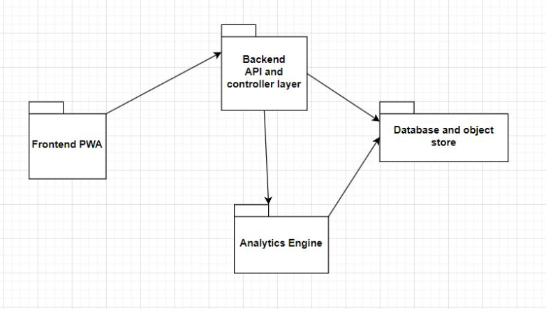

# Requirements Specification

The Republic aims to revolutionize citizen engagement with government services. This document specifies the requirements that the system must meet to achieve its goals, including both functional and non-functional aspects.

## Functional Requirements

### Core Requirements

1. **Post Feed:**
   - The system must provide a post feed where users can interact with posts through comments or other interactions.
   - Users should have the option to filter posts based on department, date, location/neighborhood, etc.

2. **Data Processing and Analysis:**
   - The system must perform sentiment analysis and other data processing on user posts.
   - It should include a language filter/censor to remove inappropriate content such as hate speech and racism.
   - Posts should be clustered based on sentiment and issue (e.g., road-related electricity incident and household-related electricity incident).

3. **Data Visualizations:**
   - Users must be able to view standard data visualizations and analytics in a visually appealing manner.
   - This includes at least two different animations and 3D visualizations.
   - Different colors should represent different areas of government.

4. **User Profile:**
   - Users can choose to post anonymously or share their details such as username, surname, and email address.

5. **Mock Data Generation:**
   - The system must be able to generate mock data to demonstrate scalability, performance, visualizations, and reports.
   - A minimum of 10,000 mock posts should be generated.

### Optional Requirements

1. **Follow-up by Officials:**
   - Users could be contacted by officials to follow up on their complaints.

2. **Custom Reports for Privileged Users:**
   - Privileged users could generate custom reports that can be executed to generate downloadable visualizations.

3. **Different Types of Posts:**
   - The system could support various types of posts such as general comments, incidents, complaints, positive feedback, and suggestions.

4. **Multilingual Support:**
   - The system could support multiple languages to cater to a broader South African population.

5. **Predictive Analytics:**
   - The system could make predictions on when and how many complaints will come in based on historical data.

6. **Integration with External Services:**
   - Integration with external services such as existing load shedding apps, sending and receiving telegram messages, and scraping social media and news outlets.

## Non-Functional Requirements

### Architectural Requirements

- **Performance:**
  - The system must be responsive and provide quick data processing and analysis.
  - Data visualizations should load promptly and smoothly.

- **Scalability:**
  - The system architecture must support scaling to accommodate a growing user base and increasing data volume.

- **Modularity:**
  - The system should be modular to facilitate future enhancements and modifications without disrupting the entire system.

   

These requirements form the foundation for the development of The Republic project, ensuring that it meets the needs of users effectively and efficiently.

---

[Back to Full Documentation](./../README.md)

Feel free to contact us at: [infiniteloopers@gmail.com](mailto:infiniteloopers@gmail.com)

    
 :lock: Secret Message

     
    
Thank you for opening this, Have a great day! :smile:

---