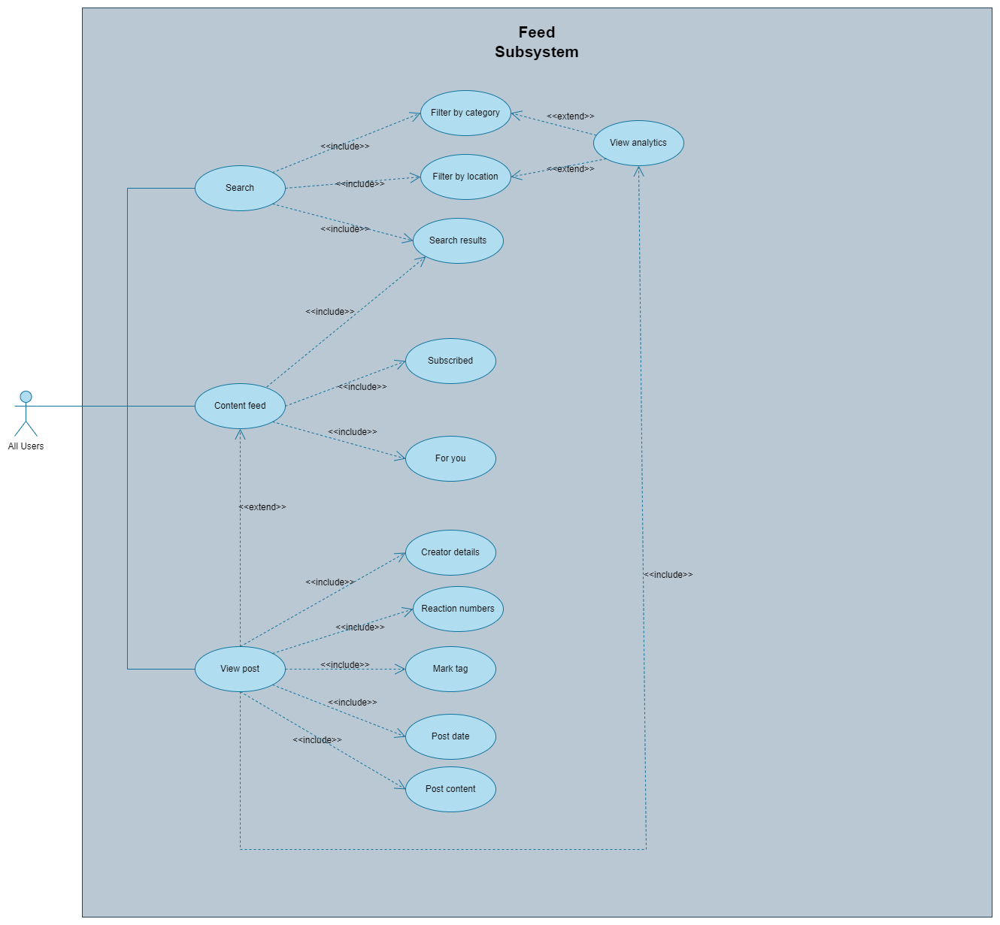

<div>
    
    <h1 style="color: darkblue;">The Republic</h1>
    <p style="color: darkblue;">A Project for EPI-USE Labs</p>
</div>

---

## Introduction
This document outlines the development of a Progressive Web App designed for users to post complaints about government service delivery. These posts will be analysed and visualised to provide insights into government services.

This platform aims to improve citizen interaction with government services, fostering transparency, accountability, and engagement through organised incident reports and data visualisation.

## User Stories and Characteristics

### Intended Users

**1. General Public**: Post complaints or compliments, view and interact with posts.

**2. Government Officials**: Monitor and respond to posts, generate reports.


### User Stories
---
#### ✏️ User Story 1: Posts
---
**1.1. Post Creation**  
As a user, I want to create posts about governmental service delivery shortcomings and interactions, so that I can raise concerns and spread awareness about the status of government services.
  
**1.2. Post Interaction**  
As a user, I want to comment or otherwise interact with other users’ posts, so that I can engage in discussions and share my thoughts.

---
#### 🔍 User Story 2: Post Filtering
---
**2.1. Post Filtering by Department**  
As a user, I want to filter posts based on the department they pertain to, so that I can find specific information relevant to my interests or needs.
  
**2.2. Post Filtering by Date**  
As a user, I want to filter posts based on the date they were posted, so that I can find recent information or look up past incidents.
  
**2.3. Post Filtering by Location/Neighborhood**  
As a user, I want to filter posts based on location or neighborhood, so that I can find information relevant to my local area.

---
#### 📊 User Story 3: Data Visualisation and Analytics
---
**3.1. Viewing Data Analytics Visualisations**  
As a user, I want to view analytics based on the data generated on the platform and standard data visualisations in a visually appealing way, so that I can understand the state of different government services.

---
#### 👤 User Story 4: User Privacy
---
**4.1: User Anonymity**  
As a user, I want the option to post anonymously, so that I can control my privacy on the platform.
 
**4.2: User Profile**  
As a user, I want to share my details, such as username, surname, and email address, when I choose to, so that I can build a public profile on the platform.

---
#### 🔑 User Story 5: User Authentication
---
**5.1: Account Creation**  
As a user, I want to create an account with my details, so that I can have a personalised experience on the platform.

**5.2: Log In**  
As a user, I want to log in using my credentials, so that I can access my account and interact with the platform.

**5.3: Role Selection**  
As a user, I want to choose my role (general public, government official) during account creation, so that I can have a customised experience based on my role.

## Functional Requirements Sorted by Subsystems


---
#### 1. Profile Management
---
- **FR1.1**: Users can manage their profile display name.
- **FR1.2**: Users can choose to post anonymously.
- **FR1.3**: Users can change their profile roles.
- **FR1.4**: Users should be able to update their profile picture.
- **FR1.5**: Users should be able to view their own posts on their profile.

---
#### 2. User Authentication
---
- **FR2.1**: Users can create accounts with a username, email address, and password.
- **FR2.2**: Users can log in using their credentials.
- **FR2.3**: Users can reset their password if forgotten.
- **FR2.4**: Users can update their account details.
- **FR2.5**: Users can select their role during account creation.

---
#### 3. Posting
---
- **FR3.1**: Users can create textual posts about governmental service delivery shortcomings and interactions.
- **FR3.2**: Users should be able to upload media (images) limited to 1 per post.
- **FR3.3**: Users should be able to choose the category of the issue when posting.
- **FR3.4**: Users should be able to pick their location showing their municipality when making a post.

---
#### 4. Interactions
---
- **FR4.1**: Users can comment on other users' posts.
- **FR4.2**: Users can react to other users' posts.
- **FR4.3**: Comments are displayed alongside the respective post.
- **FR4.4**: Users should be able to view each others profile.

---
#### 5. Feed
---

- **FR5.1**: Users can filter posts by department, date, or location.
- **FR5.2**: Users should see the feed according to their roles - different roles have different views.
- **FR5.3**: Filtered posts are displayed based on selected criteria.
- **FR5.4**: Users can view standard data analytics visualisations.
- **FR5.5**: Users should be able to see data visualisation solely based on their filter selected.

---
#### 6. Reporting
---
- **FR6.1**: Users should be able to create a report according to the dates and locations they choose.
- **FR6.2**: Reports should be statistically shown with analytics visualisation.

### 📊 Use Case Diagrams
<div>
    
</div>

<div>
    
</div>

<div>
    
</div>
<div>
    
</div>
<div>
    
</div>
<div>
    
</div>


## 📄 Service Contract
The following specifies our service contract.

### Base URL
In order to access the API URL you will need to run the server on your local machine. We will be deploying our backend at a later stage.
```
cd backend
npm i
npm run dev
```
You will see that the server is running on:
```
localhost:8080
```
### Authentication
All endpoints require authentication using a bearer token. The token should be included in the Authorization header of the request.
Header:
```
Authorization: Bearer <token>
Content-type: application/json
```
If the token is missing, invalid, or expired, the API will respond with a 401 Unauthorized status code.

### Endpoints

#### 1. Create a New Issue
- **Method:** `POST`
- **Endpoint:** `/issues`
- **Description:** Create a new issue.
- **Request Body:**
  ```json
  {
    "user_id": "string",          // UUID of the user   
    "location_id": "number",      // ID of the location
    "category_id": "number",      // ID of the category
    "content": "string",          // Content of the issue
    "media_url": "string",        // URL to any media related to the issue,
    "is_anonymous": "boolean"     // Whether the issue is reported anonymously
  }
  ```
- **Response:**
  - **201 Created**
    ```json
    {
      "success": true
    }
    ```
  - **400 Bad Request** (Invalid input data)
  - **500 Internal Server Error**

### 2. Get All Issues
- **Method:** `GET`
- **Endpoint:** `/issues`
- **Description:** Retrieve all issues.
- **Response:**
  - **200 OK**
    ```json
    [
        "success": true,
        "data":[
          {
            "issue_id": "number",
            "user_id": "string",
            "location_id": "number",
            "category_id": "number",
            "content": "string",
            "media_url": "string",
            "is_anonymous": "boolean",
            "created_at": "string",
            "resolved_at": "string",
            "sentiment": "string",
            "isOwner": "boolean"
          }
        ]
    ]
    ```

### 3. Get Issue by ID
- **Method:** `GET`
- **Endpoint:** `/issues/{id}`
- **Description:** Retrieve an issue by its ID.
- **Path Parameters:** `id` (number) - ID of the issue
- **Response:**
  - **200 OK**
    ```json
    {
      "issue_id": "number",
      "user_id": "string",
      "department_id": "number",
      "location_id": "number",
      "category_id": "number",
      "content": "string",
      "media_url": "string",
      "is_anonymous": "boolean",
      "created_at": "string",
      "resolved_at": "string",
      "sentiment": "string"
    }
    ```
  - **404 Not Found** (Issue not found)
  - **500 Internal Server Error**

### 4. Resolve an Issue
- **Method:** `PUT`
- **Endpoint:** `/issues/{id}/resolve`
- **Description:** Mark an issue as resolved.
- **Path Parameters:** `id` (number) - ID of the issue
- **Request Body:**
  ```json
  {
    "user_id": "string",
    "resolved_at": "string" // Timestamp of when the issue was resolved
  }
  ```
- **Response:**
  - **200 OK**
    ```json
    {
        "success": true
    }
    ```
  - **404 Not Found** (Issue not found)

### 5. React to an Issue
- **Method:** `POST`
- **Endpoint:** `/issues/{id}/reactions`
- **Description:** React to an issue with an emoji.
- **Path Parameters:** `id` (number) - ID of the issue
- **Request Body:**
  ```json
  {
    "user_id": "string",  // UUID of the user reacting
    "emoji": "string"     // Emoji reaction
  }
  ```
- **Response:**
  - **201 Created**
    ```json
    {
        "success": true
    }
    ```
  - **400 Bad Request** (Invalid input data)


## 🔧 Quality Requirements

### 1. Performance 🚀
Performance requirements ensure that the system can handle a high volume of users and interactions without significant latency. Since we will have a large population using this app, the system should maintain high speed and responsiveness even with many users online.
- **FR3.1**: Users can create textual posts about governmental service delivery shortcomings and interactions.
- **FR3.2**: Users should be able to upload media (images) limited to 1 per post.
- **FR4.1**: Users can comment on other users’ posts.
- **FR4.2**: Users can react to other users’ posts.

### 2. Reliability 🛡️
Reliability requirements ensure that the system is available and functional when users need it. Users should be able to create accounts, post, or reset their passwords whenever they encounter an issue in their community and need it solved urgently.
- **FR2.1**: Users can create accounts with a username, email address, and password.
- **FR2.2**: Users can log in using their credentials.
- **FR2.3**: Users can reset their password if forgotten.

### 3. Scalability 📈
Scalability requirements ensure that the system can handle growth in terms of users, data, and complexity. Since the platform is intended for the general public citizens of South Africa, it must be able to accommodate a large number of users and posts.
- **FR5.1**: Users can filter posts by department, date, or location.
- **FR5.2**: Users should see the feed according to their roles - different roles have different views.
- **FR5.3**: Filtered posts are displayed based on selected criteria.

### 4. Security 🔒
Security requirements protect the system and its data from unauthorized access and potential harm. Unauthorized access should not be possible, so only people with verified credentials should be able to perform certain actions. Municipal officials, for instance, will have specific roles that are verified and restricted.
- **FR2.4**: Users can update their account details.
- **FR2.5**: Users can select their role during account creation.
- **FR4.4**: Government officials should be able to view a user’s profile.
- **FR4.5**: Government officials should be able to message any user to follow up.

### 5. Maintainability 🔧
Maintainability requirements ensure that the system can be easily updated and improved over time. The system should be maintainable because future improvements and the addition of new functionalities like integration with external services will be necessary.
- **FR1.1**: Users can manage their profile display name.
- **FR1.2**: Users can choose to post anonymously.
- **FR1.3**: Users can change their profile roles.
- **FR1.4**: Users should be able to update their profile picture.

### 6. Usability 🖐️
Usability requirements ensure that the system is easy to use and provides a good user experience for individuals of diverse backgrounds, including different age groups and abilities. The system should be intuitive and user-friendly, ensuring that users, regardless of age or disability, can easily interact with it and perform necessary actions.
- **FR1.5**: Users should be able to view their own posts on their profile.
- **FR3.3**: Users should be able to choose the category of the issue when posting.
- **FR3.4**: Users should be able to pick their location showing their municipality when making a post.
- **FR5.4**: Users can view standard data analytics visualisations.
- **FR5.5**: Users should be able to see data visualisation solely based on their filter selected.
- **FR6.1**: Users should be able to create a report according to the dates and locations they choose.
- **FR6.2**: Reports should be statistically shown with analytics visualisation.


## 🏗️ Architectural Patterns
**Monolithic Architecture**: This architecture is chosen for its simplicity and ease of deployment, combining all functionalities into a single, unified application. It integrates User Management, Post Management, and Data Analytics and Visualisation modules, ensuring cohesive functionality and efficient data management. Postgres is used as a robust and reliable data store, providing consistent and efficient handling of large volumes of data. This approach meets core requirements effectively while being scalable and modular for future evolution.

<div>
    
</div>

## 🎨 Design Patterns
**1. Singleton**: Ensuring a single instance of key classes, such as database connection managers.

**2. Observer**: For implementing real-time updates in the post feed and notifications.

**3. Factory**: To create different types of posts and visualisations dynamically.

**4. Decorator**: For adding functionality to posts such as tagging and filtering without modifying the original object.

## ⚖️ Constraints
1. The system must not follow a serverless model.
2. The system should not be cloud-native and must be able to run on one or more Linux VMs.
3. All libraries/services used must be open source.

## 🛠️ Technology Requirements

**1. Frontend**
- 
- 

**2. Backend**
- 
- 

**3. Data Science**
- 
- 

**4. Database**
- 
- 

---

### Appendix: Changes to Previous Sections
*Note: This is where we will put old sections which have changed. Keep this document updated incrementally as changes are made to the project.*
