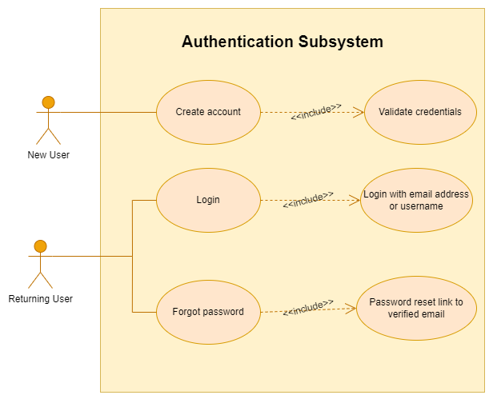
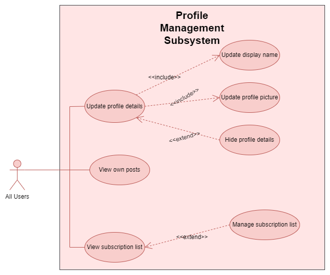
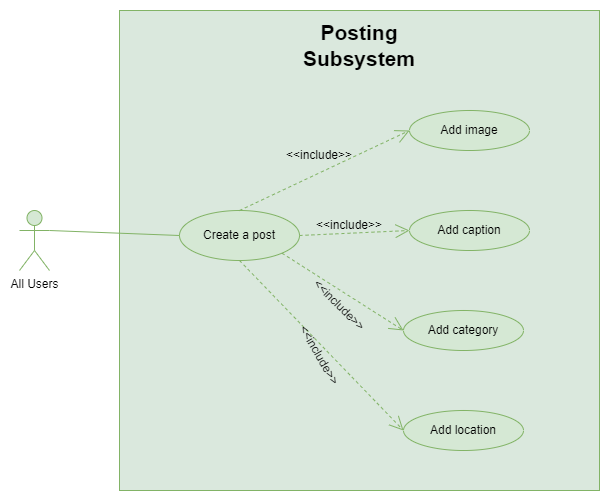
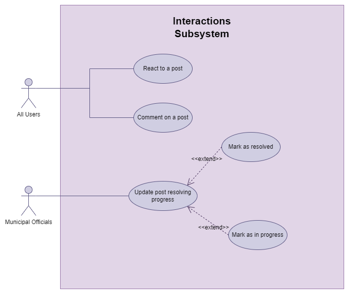
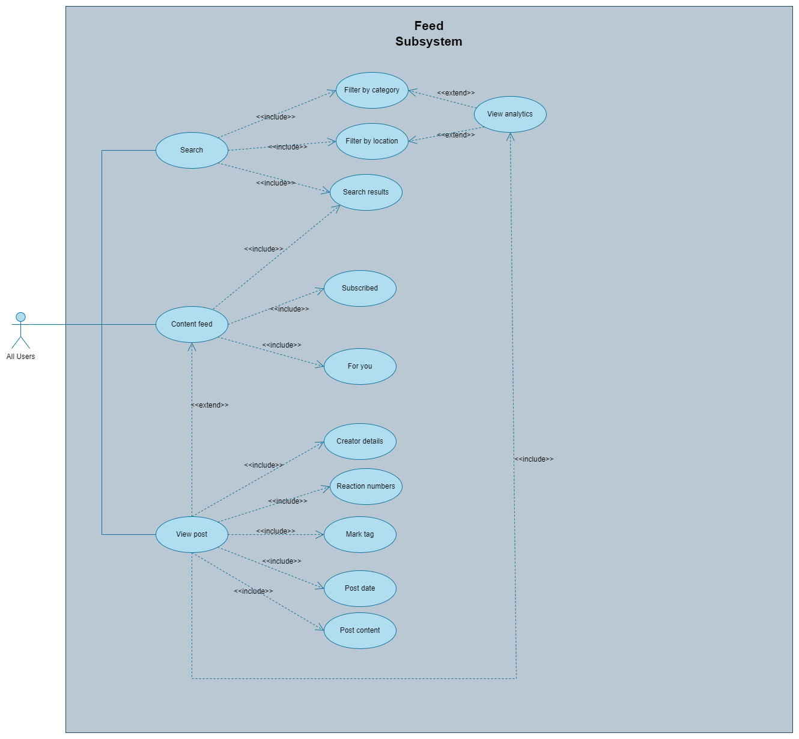
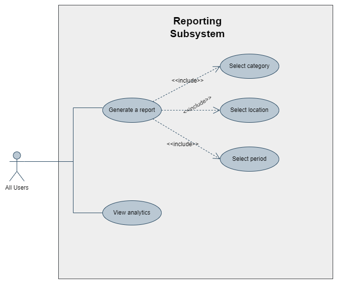

    

---

# Requirement Specification

## Introduction

This document outlines the development of a Progressive Web App designed for users to post complaints about government service delivery. These posts will be analyzed and visualized to provide insights into government services.

This platform aims to improve citizen interaction with government services, fostering transparency, accountability, and engagement through organized incident reports and data visualization.

## User Stories and Characteristics

### Intended Users

**1. General Public**: Post complaints or compliments, view and interact with posts.

**2. Government Officials**: Monitor and respond to posts, generate reports.

### User Stories

---

#### ✏️ User Story 1: Posts

---

**1.1. Post Creation**  
As a user, I want to create posts about governmental service delivery shortcomings and interactions, so that I can raise concerns and spread awareness about the status of government services.

**1.2. Post Interaction**  
As a user, I want to comment or otherwise interact with other users’ posts, so that I can engage in discussions and share my thoughts.

**1.3. Complaint Post**  
As a user, I want to create a post about a burst pipe in my area, choose my location, type my complaint, attach an image, and choose to remain anonymous, so that I can report the issue without revealing my identity.

**1.4. React to Posts**  
As a user, I want to react to my post or another user’s post, so that I can express my agreement or support for the issue.

**1.5. Mark Issue as Resolved**  
As a user, I want to mark a post as resolved once the municipality has solved the issue, so that others know the problem has been addressed.

---

#### 🔑 User Story 2: User Authentication

---

**2.1: Account Creation**  
As a user, I want to create an account with my details, so that I can have a personalized experience on the platform.

**2.2: Log In**  
As a user, I want to log in using my credentials, so that I can access my account and interact with the platform.

**2.3: Sign Up**  
As a new user, I want tobe able to create an account so that I can be able to post, react, and interact on the platform.

---

#### 📊 User Story 3: Data Visualization and Analytics

---

**3.1. Viewing Data Analytics Visualizations and Reports**  
As a user, I want to view analytics based on the data generated on the platform and standard data visualizations in a visually appealing way, so that I can understand the state of different government services.

**3.2. Province-Wide Visualizations**  
As a user, I want to see visualizations showing issues faced across all provinces, and by pressing on the circles representing different categories, I can identify which areas have the most issues, by the size of the circles.

**3.3. Progress Reports**  
As a user, I want to see reports that show the progress of most issues over the past weeks or years in different formats like bar graphs and line graphs, so that I can track improvements or ongoing problems.

---

#### 👤 User Story 4: User Privacy

---

**4.1: User Anonymity**  
As a user, I want the option to post anonymously, so that I can control my privacy on the platform.

**4.2: User Profile**  
As a user, I want to share my details, such as username, surname, and email address, when I choose to, so that I can build a public profile on the platform.

**4.3. Profile Management**  
As a user, I want to navigate to my profile where it will show my details, issues, and what has been resolved either by me or the municipality, so that I can keep track of my activity on the platform.

**4.4. Edit Profile**  
As a user, I want to edit my profile display name, bio, and profile picture by navigating to the edit profile section and making the necessary updates, so that my profile reflects my current information.

---

#### 📋 User Story 5: Subscriptions and Filtering

---

**5.1. Issue Subscription**  
As a user, I want to subscribe to an issue or a category if I am interested in that specific issue because it is in my area and I need updates on it, so that I can stay informed.

**5.2. Feed Sorting**  
As a user, I want to sort my feed of issues from oldest to newest or by most comments, so that I can view the posts in the order that interests me most.

**5.3. Feed Filtering**  
As a user, I want to filter my feed by category, such as electricity or water, so that I can easily find posts related to my interests or concerns.

## Functional Requirements Sorted by Subsystems

---

#### 1. Profile Management

---

- **FR1.1**: Users can manage their profile display name.
- **FR1.2**: Users can choose to post anonymously.
- **FR1.3**: Users can change their profile roles.
- **FR1.4**: Users can update their profile picture.
- **FR1.5**: Users can view their posts on their profile.
- **FR1.6**: Users can edit their bio information.

---

#### 2. User Authentication

---

- **FR2.1**: Users can create accounts with a username, email address, and password.
- **FR2.2**: Users can log in using their credentials.
- **FR2.3**: Users can update their account details.
- **FR2.4**: Users can sign up and create an account.

---

#### 3. Posting

---

- **FR3.1**: Users can create textual posts about governmental service delivery shortcomings and interactions.
- **FR3.2**: Users can upload media (images) limited to 1 per post.
- **FR3.3**: Users can choose the category of the issue when posting.
- **FR3.4**: Users can pick their location showing their municipality when making a post.
- **FR3.5**: Users can to mark their posts as resolved.

---

#### 4. Interactions

---

- **FR4.1**: Users can comment on other users' posts.
- **FR4.2**: Users can react to other users' posts.
- **FR4.3**: Comments are displayed alongside the respective post.
- **FR4.4**: Users can subscribe to the issue or category of that post.
- **FR4.5**: Users can react to their posts.

---

#### 5. Feed

---

- **FR5.1**: Users can sort the posts on their feed from oldest to newest, or by most comments.
- **FR5.2**: Users can filter the posts on their feed by category, such as electricity, water, etc.
- **FR5.3**: Users can subscribe to specific issues or categories to receive updates.

---

#### 6. Reporting and Analytics

---

- **FR6.1**: Users should be able to create a report according to the dates and locations they choose.
- **FR6.2**: Reports should be statistically shown with analytics visualization.
- **FR6.3**: Users can view standard data analytics visualizations according to the province.
- **FR6.4**: Users can zoom into an issue analytics circle to see how huge it is in that area.

### 📊 Use Case Diagrams

    

    

    

    

    

    

