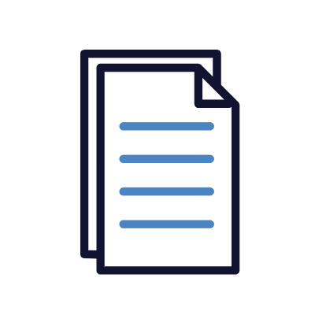

    

# User Manual

The Republic is a platform that aims to improve citizen interaction with government services, fostering transparency, accountability, and engagement through organised incident reports and data visualisation.

## Contents

1. [Signing Up](#signing-up)
2. [Logging In](#logging-in)
3. [Homepage](#homepage)
4. [Navigation Bar](#navbar)
5. [Writing a post](#writing-a-post)
6. [Making a comment](#Making-a-comment)
7. [Subscription & Filtering](#subscription-and-Filtering)
8. [Profile Page Manangement](#Profile-Page-Management)

## Signing Up  [Back to contents](#contents)

**1. Fill in your details in the relevant fields** 
**2. Click "Signup" at the bottom of the screen**

## Logging In  [Back to contents](#contents)

**1. Click on "login"**

**2. Fill in your details in the relevant fields** 
**3. Click "Login" at the bottom of the screen**

 

## Homepage  [Back to contents](#contents)

When you log in, you will be taken to the homepage. This is an example of what the homepage will look like.

 

## NavBar  [Back to contents](#contents)

The NavBar consists of your General section which includes, home page, visualization, reports and notifcations page. It also consists of the Accounts section whereby users can manage their accounts. It consists of the Profile, Settings and an option to logout.

 

## Writing a Post  [Back to contents](#contents)

**1. Write in the input box**

 

**2. Select a category under which your issue falls under**

**3. Select a Mood under which your issue falls under**

**4. You can choose to be annonymous or not by clicking the checkbox**

**5. Once done, you can click on "Post" to post your issue**

## Making a comment  [Back to contents](#contents)

**1. Click on the chatbox icon in order to make a comment on a specific issue** 

 

**2. Type in your comment into the input box** 
 

**3. Once you are done typing out your comment, click on "Send" to post it** 
 

## Subscription and Filtering  [Back to contents](#contents)

Users can subscribe to what they are interested in. Users can also filter and sort the issues displayed on the homepage.

**1. To subscribe click on the green bell icon**

**2. Choose what you want to subscribe to. It could be the specific Issue, the category under which the issue falls under or the location of the issue** 

**3. You can sort and Filter the issue posts displayed by clicking the sort and filter found on the right hand side bar**
 

**4. You can sort the issues according to "Newest", "Oldest" or "Most Comments.** 
 

**5. You can Filter the issues according to your subscriptions or the different categories.** 

## Profile Page Management  [Back to contents](#contents)

Clicking on Profile on the left side bar will take you to the profile page whereby users may make changes 

**1. To edit your profile click on "Edit Profile** 
 

**2. Add the relevant information then click on "Save" to make the changes** 

 

[Back](./../README.md) 
[Back to main](/README.md)

---
