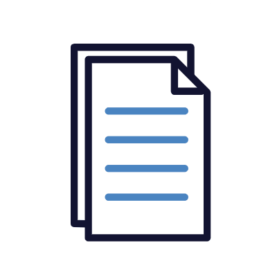

    

# User Manual

The Republic is a platform that aims to improve citizen interaction with government services, fostering transparency, accountability, and engagement through organised incident reports and data visualisation.

## Contents

1. [Signing Up](#signing-up)
2. [Logging In](#logging-in-back-to-contents)
3. [Homepage](#homepage-back-to-contents)
4. [Navigation Bar](#navbar-back-to-contents)
5. [Creating a post](#Creating-a-post-back-to-contents)
6. [Making a comment](#making-a-comment-back-to-contents)
7. [Subscription & Filtering](#subscription-and-filtering-back-to-contents)
8. [Profile Page Manangement](#profile-page-management-back-to-contents)
9. [Analytics](#analytics-back-to-contents)
10. [Setting your location](#Setting-your-location-back-to-contents)
11. [Leaderboard](#Leaderboard-back-to-contents)
12. [Organizations](#Organizations-back-to-contents)

## Signing Up

**1. Fill in your details in the relevant fields** 
**2. Click "Signup" at the bottom of the screen**

## Logging In  [Back to contents](#contents)

**1. Click on "login"**

**2. Fill in your details in the relevant fields** 
**3. Click "Login" at the bottom of the screen**

 

## Homepage  [Back to contents](#contents)

When you log in, you will be taken to the homepage. This is an example of what the homepage will look like.

 

## NavBar  [Back to contents](#contents)

The NavBar consists of your General section which includes, home page, visualization, reports and notifcations page. It also consists of the Accounts section whereby users can manage their accounts. It consists of the Profile, Settings and an option to logout.

 

## Creating a Post  [Back to contents](#contents)

**1. Write in the input box**

 

**2. Select a category under which your issue falls under**

**3. Select a Mood under which your issue falls under**

**4. Pick your location**

**5. You can choose to include an image**

**6. You can choose to be annonymous or not by clicking the checkbox**

**7. Once done, you can click on "Post" to post your issue**

## Making a comment  [Back to contents](#contents)

**1. Click on the chatbox icon in order to make a comment on a specific issue** 

 

**2. Type in your comment into the input box** 
 

**3. Once you are done typing out your comment, click on "Send" to post it** 
 

## Subscription and Filtering  [Back to contents](#contents)

Users can subscribe to what they are interested in. Users can also filter and sort the issues displayed on the homepage.

**1. To subscribe click on the green bell icon**

**2. Choose what you want to subscribe to. It could be the specific Issue, the category under which the issue falls under or the location of the issue** 

**3. You can sort and Filter the issue posts displayed by clicking the sort and filter found on the right hand side bar**
 

**4. You can sort the issues according to "Newest", "Oldest" or "Most Comments.** 
 

**5. You can sort the issues according to your subscriptions or the different categories.** 

**7. You can sort the issues according to your location.** 

## Profile Page Management  [Back to contents](#contents)

Clicking on Profile on the left side bar will take you to the profile page whereby users may make changes 

**1. To edit your profile click on "Edit Profile** 
 

**2. Add the relevant information then click on "Save" to make the changes** 

 

## Analytics  [Back to contents](#contents)

The analytics page consists of two tabs, the Reports tab whereby you can view different reporting charts and a visualization tab whereby you can view a more explorative diagram.

**1. To filter the reporting charts click on the filter charts button** 
 

**2. Click on the visualization tab to navigate to the explorative diagram** 
 

**3. Click on the different circles on the explorative diagram for more information** 
 

## Setting your location  [Back to contents](#contents)

**1. Navigate to your profile page** 

**2. Click on Edit Profile** 
 

**3. Click on Update Location** 
 

**4. Choose whether to make use of a pin location or manually type your location** 
 

## Leaderboard  [Back to contents](#contents)
The leaderboard showcasses the point systems of the web app. Your ranking and points as well as the ranking and points of the top 10 users are displayed. 
 

**1. You can filter the table ranking according to country, province, city, and suburb ranking once you've set your location for your profile. Click on filter to do so** 
 

## Organizations  [Back to contents](#contents)

Organizations allow for collaborative issue reporting and management within The Republic platform.

### Key Features
- Create or join organizations
- Manage organization membership
- Post organization-specific content
- View organization activity logs
- Set join policies for organizations

### Creating an Organization
**1. Navigate to the Organizations page.**  

2. Click on "Create Organization".
3. Fill in the organization details (name, description, etc.).
4. Set the join policy (open, request to join, or invite-only).
5. Click "Create" to finalize.

### Joining an Organization
1. Search for the organization you want to join. 
2. Click on the organization to view its details.
3. Click "Join" or "Request to Join" (depending on the organization's policy).
4. If it's a request, wait for approval from the organization admin.

### Managing Organization Members
1. Go to your organization's page.
2. Click on "Members" or "Manage Members".
3. Here you can view all members, remove members, or promote members to admin status.

### Posting Organization Content
1. Navigate to your organization's page.
2. Look for a "Create Post" or "New Post" button.
3. Write your post and add any relevant attachments.
4. Click "Post" to publish the content to your organization's feed.

### Viewing Organization Activity Logs
1. Go to your organization's page.
2. Look for an "Activity" or "Logs" section.
3. Here you can view recent actions and events within the organization.

### Downloading Detailed Reports
1. Navigate to your organization's page.
2. Look for a "Reports" or "Analytics" section.
3. Click on "Download Report"
4. Enter your email and the report will be emailed to you once it is ready.

Note: Detailed reports may include information such as:
- Member engagement statistics
- Issue resolution rates
- Top contributors within the organization
- Trending categories or locations for reported issues
- Overall organization growth and activity metrics

These reports can help organization administrators make data-driven decisions and track the organization's impact over time.

[Back](./../README.md) 
[Back to main](/README.md)

---
