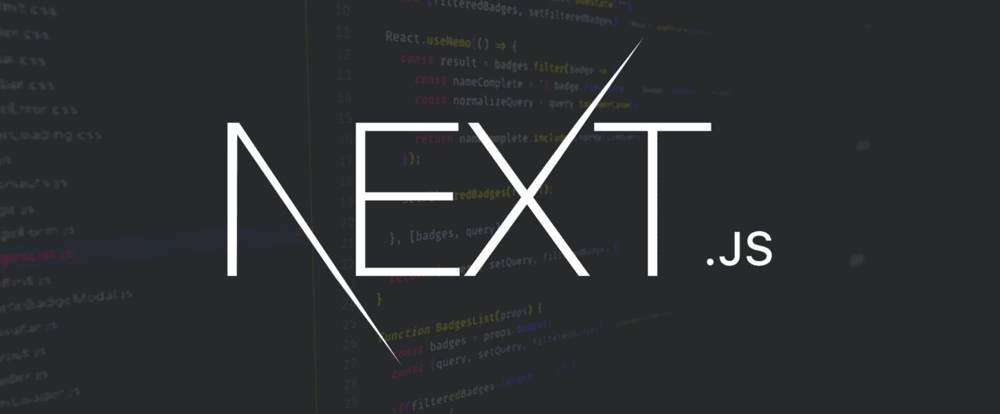

# Next.js Frontend with Chakra UI and TypeScript



## Table of Contents
1. [Introduction](#introduction)
2. [Getting Started](#getting-started)
    - [Coding Standards](#coding-standards)
    - [Creating a Page](#creating-a-page)
3. [Understanding Chakra UI](#understanding-chakra-ui)
    - [Introduction to Chakra UI](#introduction-to-chakra-ui)
    - [Theme Customization](#theme-customization)
4. [Backend Integration](#backend-integration)
    - [API Integration](#api-integration)
5. [Project Structure](#project-structure)
6. [Running the Project](#running-the-project)
7. [Learn More About Next.js](#learn-more-about-nextjs)
8. [Deploying The Application on Vercel](#deploying-the-application-on-vercel)

## Introduction

Welcome to the documentation for our Next.js frontend with Chakra UI and TypeScript. This guide will provide you with all the information you need to get started, develop, and integrate your frontend application seamlessly.

## Getting Started

### Coding Standards:

- Maintaining high coding standards is crucial for the success of The Republic project. We have a document which provides guidelines and best practices for ensuring a clean, readable, and maintainable codebase.
- Please read the document here: [Coding Standards](./../documentation/specifications/CodingStandards.md)
- Read this for the Full Documentation: [Documentation](./../documentation/README.md)

### Creating a Page

1. **Navigate to the pages directory:**

    ```bash
    cd app
    ```

2. **Create a new file for your page, for example, `/{pagename}/page.tsx`:**

    ```typescript
    import { Box, Heading } from '@chakra-ui/react';

    const IndexPage = () => {
      return (
        <Box>
          <Heading>Hello, Next.js!</Heading>
        </Box>
      );
    };

    export default IndexPage;
    ```

## Understanding Chakra UI

### Introduction to Chakra UI

Chakra UI is a simple, modular, and accessible component library that provides building blocks for faster and easier web development. It offers a wide range of customizable UI components and styles out of the box, allowing you to focus more on building your application rather than reinventing the wheel.

### Theme Customization

Chakra UI provides an easy way to customize the theme of your application. You can modify colors, typography, spacing, and more to match your brand or design preferences. This makes it simple to create visually appealing and consistent user interfaces across your application.

## Backend Server Integration

Next.js provides the capability to create API routes that can interact with the backend server. These routes enable various functionalities such as fetching data from a database, handling authentication, or performing other server-side operations necessary for the application.

When integrating with a Node.js Express backend, the frontend typically communicates with the backend server through HTTP requests, commonly using POST requests to send data or perform actions.

Here's an example of how to consume the Node.js Express backend server via POST requests in the Next.js frontend:

```typescript
import { useState } from 'react';
import axios from 'axios';

const MyComponent = () => {
  const [data, setData] = useState(null);

  const fetchData = async () => {
    try {
      const response = await axios.post('/api/my-endpoint', {
        // data to send to the backend
      });
      setData(response.data);
    } catch (error) {
      console.error('Error fetching data:', error);
    }
  };

  return (
    <div>
      <button onClick={fetchData}>Fetch Data</button>
      {data && <pre>{JSON.stringify(data, null, 2)}</pre>}
    </div>
  );
};

export default MyComponent;
```

In this example, the frontend component sends a POST request to the `/api/my-endpoint` endpoint of the backend server. You can replace `/api/my-endpoint` with the actual endpoint on our backend API, [View Backend Server Documentation](./../backend/README.md).

Alternatively, on the backend side, you may define the corresponding route to handle the incoming POST request and perform the necessary operations, such as fetching data from a database or processing the request:

```typescript
// Example backend route handling POST request
app.post('/api/my-endpoint', async (req, res) => {
  try {
    // Process the request and fetch data from the database
    const data = await fetchDataFromDatabase();

    // Send the fetched data back to the frontend
    res.json(data);
  } catch (error) {
    console.error('Error handling POST request:', error);
    res.status(500).json({ error: 'Internal Server Error' });
  }
});
```

> NB: Ensure that the backend server is running, [View Backend Server Documentation](./../backend/README.md).

## Project Structure

Here's a quick overview of the project structure:

```
/nextjs-frontend
|-- app
|   |-- pages
|   |   |-- index.tsx
|   |   |-- auth
|   |   |   |-- login.tsx
|   |   |   |-- signup.tsx
|   |-- components
|   |   |-- Header.tsx
|   |   |-- Footer.tsx
|-- lib
|   |-- utils.ts
|-- README.md
|-- .env
|-- Dockerfile
|-- next.config.mjs
|-- package.json
|-- tsconfig.json
```

## Running the Frontend Application

- #### Running The Development Server:

    ```bash
    npm i
    npm run dev
    ```

- #### Running the Application locally in a Docker Container

    - Changing working directory to the frontend folder
        ```bash
        cd frontend
        ```
    - Building the application locally:
        ```bash
        docker build -t the_republic .
        ```

    - Running the application locally:
        ```bash
        docker run -p 3000:3000 -d the_republic
        ```
    - Stopping and Removing all Containers Locally:
        ```bash
        docker stop $(docker ps -a -q)
        docker rm $(docker ps -a -q)
        ```

    - Removing all Unused Docker Objects:
        ```bash
        docker system prune -a
        ```

> Open [http://localhost:3000](http://localhost:3000) with your browser to see the result. The page auto-updates as you edit the file.

## Learn More About Next.js

To learn more about Next.js, take a look at the following resources:

- [Next.js Documentation](https://nextjs.org/docs) - learn about Next.js features and API.
- [Learn Next.js](https://nextjs.org/learn) - an interactive Next.js tutorial.

You can check out [the Next.js GitHub repository](https://github.com/vercel/next.js/) - your feedback and contributions are welcome!

## Deploying The Application on Vercel

The easiest way to deploy your Next.js app is to use the [Vercel Platform](https://vercel.com/new?utm_medium=default-template&filter=next.js&utm_source=create-next-app&utm_campaign=create-next-app-readme) from the creators of Next.js.

Check out our [Next.js deployment documentation](https://nextjs.org/docs/deployment) for more details.

---

[Read Project Documentation](./../documentation/README.md)

Feel free to contact us at: [infiniteloopers@gmail.com](mailto:infiniteloopers@gmail.com)

<details>
    <summary> :lock: Secret Message</summary>
    <br/>
    <p>Thank you for opening this, Have a great day! :smile:</p>
</details>

---
