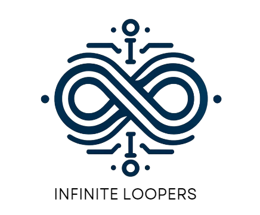

    
    <h1 style="color: darkblue;">The Republic</h1>
    
A Project for EPI-USE Labs

---

## Introduction
This document outlines a Progressive Web App (PWA) using React for users to post complaints about government service delivery. These posts will be analyzed and visualized to provide insights into government services. The platform aims to improve citizen interaction with government services, fostering transparency, accountability, and engagement through organized incident reports and data visualization.

## User Stories / User Characteristics

### Intended Users
**1. General Public**: Post complaints or compliments, view and interact with posts.

**2. Government Officials**: Monitor and respond to posts, generate reports.

**3. Data Analysts**: Analyze data trends and generate visualizations.

### User Stories
#### ✏️ User Story 1: Post Interaction

**1.1. Post Creation**  
As a user, I want to create posts about governmental service delivery shortcomings and interactions, so that I can raise concerns and spread awareness about the status of government services.
  
**1.2. Post Interaction**  
As a user, I want to comment or otherwise interact with other users’ posts, so that I can engage in discussions and share my thoughts.

#### 🔍 User Story 2: Post Filtering
**2.1. Post Filtering by Department**  
As a user, I want to filter posts based on the department they pertain to, so that I can find specific information relevant to my interests or needs.
  
**2.2. Post Filtering by Date**  
As a user, I want to filter posts based on the date they were posted, so that I can find recent information or look up past incidents.
  
**2.3. Post Filtering by Location/Neighborhood**  
As a user, I want to filter posts based on location or neighborhood, so that I can find information relevant to my local area.

#### 📊 User Story 3: Data Visualization and Analytics
**3.1. Viewing Data Analytics Visualizations**  
As a user, I want to view analytics based on the data generated on the platform and standard data visualizations in a visually appealing way, so that I can understand the state of different government services.

#### 👤 User Story 4: User Privacy
**4.1: User Anonymity**  
As a user, I want the option to post anonymously, so that I can control my privacy on the platform.
 
**4.2: User Profile**  
As a user, I want to share my details, such as username, surname, and email address, when I choose to, so that I can build a public profile on the platform.

## Functional Requirements

### Subsystems
#### ✏️ 1. Post Creation
- FR1: Users can create posts about governmental service delivery shortcomings and interactions.
- FR2: Users receive a confirmation message after successfully posting.
  
#### 💬 2. Post Interaction
- FR3: Users can comment on other users' posts.
- FR4: Comments are displayed alongside the respective post.

#### 🔍 3. Post Filtering
- FR5: Users can filter posts by department, date, or location.
- FR6: Filtered posts are displayed based on selected criteria.

#### 📊 4. View Data Analytics Visualizations
- FR7: Users can view standard data analytics visualizations.
- FR8: Visualizations are presented in a visually appealing manner.

#### 👤 5. Manage User Privacy
- FR9: Users can choose to post anonymously.
- FR10: Users can manage their profile information.

#### 🔑 6. Log In and Account Creation
- FR11: Users can create accounts with a username, email address, and password.
- FR12: Users can log in using their credentials.
- FR13: Users can reset their password if forgotten.
- FR14: Users can update their account details.

### 📊 Use Case Diagrams
- TODO: Add use case diagrams per subsystem

## 📄 Service Contracts
- TODO: Detail the service contracts, including the operations, inputs, outputs, and any preconditions or postconditions.

## 🔧 Quality Requirements
**1. Performance**
The system should handle up to 10,000 concurrent users with minimal latency.

**2. Reliability**: The system should have an uptime of 99.9%.

**3. Scalability**: The system should scale horizontally to handle increasing loads.

**4. Security**: The system should ensure data privacy and protect against common vulnerabilities such as SQL injection, XSS, and CSRF.

**5. Maintainability**: The codebase should be modular and well-documented to facilitate maintenance and updates.

**6. Usability**: The UI should be intuitive and accessible.

## 🏗️ Architectural Patterns
**1. Microservices**: The application will use a microservices architecture to ensure modularity and scalability.

**2. MVC (Model-View-Controller)**: This pattern will be used in the frontend to separate concerns and enhance maintainability.

**3. Monolithic???**

## 🎨 Design Patterns
**1. Singleton**: Ensuring a single instance of key classes, such as database connection managers.

**2. Observer**: For implementing real-time updates in the post feed and notifications.

**3. Factory**: To create different types of posts and visualizations dynamically.

**4. Decorator**: For adding functionality to posts such as tagging and filtering without modifying the original object.

## ⚖️ Constraints
1. System must not follow a serverless model.

2. System should not be cloud-native and must be able to run on one or more Linux VMs.

3. All libraries/services used must be open source.

## 🛠️ Technology Requirements
**1. Frontend**
- Next.js
- React

**2. Backend**
- Node.js with Express

**3. Data Science**
- Python via Django

**4. Database**
- PostgreSQL (Supabase)

---

### Appendix: Changes to Previous Sections
*Note: This is where we will put old sections which have changed. Keep this document updated incrementally as changes are made to the project.*
